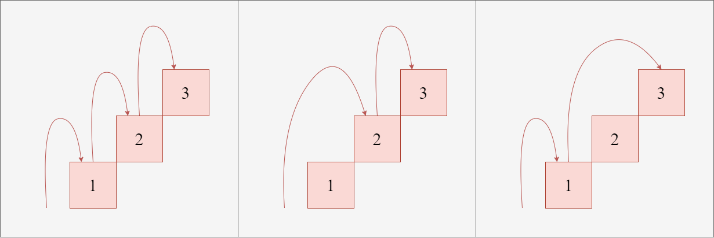
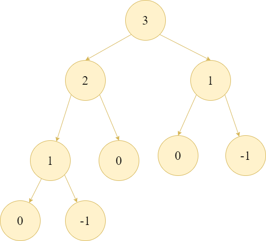

# 基礎動態規劃

~~~admonish note title="作者"
D1stance (吳翰平)
~~~

在枚舉法中，我們說暴力是一個可以保證正確性的解法，只要給他足夠的時間，幾乎可以解決世界上所有的問題。但枚舉法的問題是所花費的時間太多了，我們先來看看怎麼用暴力搜尋法解決問題，再看看我們如何從中找到可以優化的地方，最終得出動態規劃的概念。

~~~admonish info title="例題"
假設你正在爬樓梯，
需要走 $n$ 階才能走到樓頂，
因為腳長跟安全問題每次最多跨 $1$ 階或 $2$ 階，
請問走到樓頂有幾種方法?

- $1 \le n \le 50$
~~~

以 $n = 3$ 為例，
我們有以下幾種走法：
- 1, 1, 1
- 1, 2
- 2, 1



如上圖所示，
我們走到第三階有兩種可能：
- 從第二階走一階上去
- 從第一階走兩階上去

那走到第二階又有兩種可能：
- 從第一階走一階上去
- 從零階走兩階上去

因此，我們其實可以發現，
走到第 $n$ 階的方法數量等於走到第 $n-1$ 階的方法數量加上走到第 $n-2$ 階的方法數量，
也就是說我們可以用以下的遞迴式來表示：
$$
f(n) = f(n-1) + f(n-2)
$$

以程式碼來表示就是：
```cpp
long long f(int i)
{
    if(i == 0)
        return 1; // 找到一個從第 0 階開始的合法走法
    if(i < 0)
        return 0; // 非法走法
    return f(i - 1) + f(i - 2);
}
```

因為對於每個 $i$，
我們都會需要計算出 $f(i-1)$ 和 $f(i-2)$ 的值，
所以時間複雜度是 $\mathcal{O}(2^n)$，
現在的效率是很差的，無法通過 $n = 50$ 的測試，
因此我們需要想辦法優化。

<center>

</center>

從上圖的遞迴過程中可以發現，有很多問題在遞迴過程中被重複計算了，
還記得我們在遞迴那章節中提到可以用額外的空間來記錄已經計算過的值嗎？

我們可以用一個陣列來記錄每個 $f(i)$ 的值，
這樣就可以避免重複計算，因為只要求出 $1 \sim n $ 的值，
每一格只要詢問前兩格的值就可以了，所以時間複雜度就變成 $T(n) = 2n \in \mathcal{O}(n)$。

這個技巧我們稱為記憶化搜尋 (Memoization)，
也就是在遞迴的過程中記錄已經計算過的值，
這樣就可以避免重複計算，提升效率。

```cpp
vector<long long> dp(51, -1); // 初始化 dp 陣列
long long f(int i)
{
    if(i == 0)
        return 1; // 找到一個從第 0 階開始的合法
    if(i < 0)
        return 0; // 非法走法
    if(dp[i] != -1) // 如果已經計算過了，就直接返回
        return dp[i];
    return dp[i] = f(i - 1) + f(i - 2);
    // 這個寫法是先將 f(i - 1) + f(i - 2) 的值存到 dp[i] 中，
    // 然後再 return dp[i] 的值。
}
```

那麼，在記憶化搜索的過程中，我們發現答案會從 $f(1), f(2), \ldots, f(n)$ 一直被計算到 $f(n)$，
也就是先得出小 $i$ 的值，再慢慢累積到大 $i$ 的值，
這樣的過程其實可以用迴圈來實現，由小到大計算每個值，
這樣就不需要遞迴了，時間複雜度還是 $\mathcal{O}(n)$。

```cpp
vector<long long> dp(51, -1); // 初始化 dp 陣列
dp[0] = 1; // 第 0 階只有一種走法
for(int i = 1; i <= n; ++i)
{
    if(i == 1)
        dp[i] = 1; // 第 1 階只有一種走法
    else
        dp[i] = dp[i - 1] + dp[i - 2]; // 第 i 階的走法等於第 i-1 階和第 i-2 階的走法之和
}
```

筆者個人不喜歡額外做判斷，容易出錯，
因為轉移方程式已經包含了所有的情況，
所以比較喜歡所有的答案都是透過轉移方程式計算出來的。

因為 $f(i) = f(i-1) + f(i-2)$ 在 $i = 1$ 時會因為 $f(i - 2)$ 的部分導致陣列索引值有負號造成問題，
筆者喜歡將答案往右偏移兩格，變成 $f(i + 2) = f(i + 1) + f(i)$，
這樣就不會有負號的問題了，
因此我們可以將陣列的大小設為 $n + 3$，
這樣就可以避免負號的問題了。

```cpp
vector<long long> dp(n + 3, -1); // 初始化 dp 陣列
dp[0 + 2] = 1; // 第 0 階只有一種走法
for(int i = 1; i <= n; ++i)
    dp[i + 2] = dp[i + 1] + dp[i]; // 第 i 階的走法等於第 i-1 階和第 i-2 階的走法之和
```

因為要求解的問題中，有很多重疊的部分，所以透過用空間換取時間來優化演算法的時間複雜度，這樣技巧我們稱為動態規劃 (Dynamic Programming)，

第一種用遞迴從大問題開始拆解，慢慢計算出小問題的值，稱為自頂向下 (Top-Down) 的動態規劃，

第二種用迴圈從小問題開始計算，慢慢累積到大問題的值，稱為自底向上 (Bottom-Up) 的動態規劃，

這兩種方法都可以解決問題，但自底向上的方法通常更有效率，
因為它不需要額外的遞迴呼叫開銷，但是以初學者而言，可能會對遞迴的思維方式更容易理解。

## 動態規劃的概念

我們在求解問題的時候，從問題的答案往回推有時是會比較容易的，當我們發現將大問題拆解成小問題的時候，如果有很多問題是會被重複詢問的，那我們就可以透過動態規劃來解決這個問題。

動態規劃求解問題有以下三個特性：
1. **最優子結構 (Optimal Substructure)**：問題的最優解可以由其子問題的最優解組成。
2. **重疊子問題 (Overlapping Subproblems)**：問題可以被拆解成多個子問題，這些子問題會被重複計算。
3. **無後效性 (No Aftereffect)**：子問題答案算好後，後續的計算不會影響到已經計算好的子問題答案。

因為這幾個特性，我們才可以透過空間換取時間，來大幅度減少計算的成本。

在計算時間複雜度的時候，我們通常會考慮以下幾個方面：
- **狀態數量**：我們需要考慮有多少種不同的子問題需要計算。
- **狀態轉移方程式**：我們需要考慮每個子問題的計算方式，通常是透過遞迴或迴圈來實現。
- **狀態轉移的時間複雜度**：我們需要考慮每個子問題的計算時間，通常是常數時間或線性時間。

因為動態規劃使用了額外的空間來記錄已經計算過的值，所以除了時間複雜度以外也要考慮空間複雜度，通常是 $\mathcal{O}(n)$ 或 $\mathcal{O}(n^2)$，因為 C++ 陣列大約可接受最高 $10^7$ 的大小，所以其實比起時間複雜度來說，空間複雜度的限制是比較嚴格的。

## 打家劫舍

~~~admonish info title=""
現在有 $n$ 間房子，第 $i$ 間房子裡面有 $c_i$ 元的現金，
現在有一個小偷要進去偷錢，
當某個房子被偷時，相鄰的兩間房子的主人會提高警覺，
如果小偷進去了相鄰的房子就會被抓到，
請問小偷在不被抓的情況下，能偷到最多多少錢?

- $1 \le n \le 10^5$
- $1 \le c_i \le 10^9$
~~~

假設 $c = [2, 7, 9, 3, 1]$

選擇偷第 $1, 3, 5$ 間房子是最好的，
可以得到 $2 + 9 + 1 = 12$ 的錢。

我們要先確立好問題是什麼，這問題其實跟子集合枚舉有點像，
只是加上了相鄰數字不能同時被選取的限制，
因此我們可以用遞迴的方式來解決這個問題。

一開始你可能會想要這樣設計遞迴式，

$f(\text{第一間房子偷與不偷}, \text{第二間房子偷與不偷}, \ldots, \text{第 n 間房子偷與不偷})$ 代表對於這 $n$ 間房子，
偷與不偷的所有組合下能獲得的最大金額，
首先這個遞迴有一個明顯的問題，就是參數數量是不確定的，
這樣沒有一個簡單的方法可以轉程式碼跟設計轉移方程式。

那麼用二進位的方法來表示每一間房子偷與不偷的狀態呢？
$f(i, s)$ 代表前 $i$ 間房子在狀態 $s$ 下能獲得的最大金額，
這樣的話 $s$ 會是一個 $n$ 位元的數字，
最多只能考慮約 $n = 20$ 的情況，
還無法解決我們的問題。

所以我們繼續深入思考，第 $i$ 間房子能否偷取，只跟左右兩間房子有關，
跟更遠的房子沒有關係，所以我們只要維護最近的兩間房子的狀態就可以了，
如果我們從後面開始考慮，
- 如果第 $i$ 間房子偷了，那麼答案會從第 $i-1$ 間房子不偷的答案加上第 $i$ 間房子的錢，
- 如果第 $i$ 間房子不偷，那麼答案會從第 $i-1$ 間房子偷或不偷的答案中取最大的值。

因此我們可以設計出以下的轉移方程式：

$f(i, s = 0) = \max(f(i - 1, 0), f(i - 1, 1))$ <br>
$f(i, s = 1) = f(i - 1, 0) + c_i$

這裡的 $s$ 代表第 $i$ 間房子是否偷取，
- 如果 $s = 1$，代表第 $i$ 間房子被偷了，
- 如果 $s = 0$，代表第 $i$ 間房子沒有被偷。

我們可以用一個陣列來記錄每個房子被偷或不被偷的最大金額，
因此總共有 $2n$ 種狀態，每個狀態最多只要知道兩個狀態的值，而且可以馬上得知，所以時間複雜度為 $\mathcal{O}(n)$，
空間複雜度為 $\mathcal{O}(n)$。

### 狀態優化

定義新的子問題 $g(i) = \max(f(i, 0), f(i, 1))$，
也就是第 $i$ 間房子偷或不偷的最大金額，
那麼我們可以將轉移方程式簡化為：

原本關係式中 $f(i - 1, 0) = \max(f(i - 2, 0), f(i - 2, 1))$，
其實就是 $g(i - 1)$，

那原本關係式中 $f(i - 1, 1) = f(i - 2, 0) + c_i$，
其實就是 $g(i - 2) + c_i$，也就是說我們可以將轉移方程式簡化為：
$$
    g(i) = \max(g(i - 1), g(i - 2) + c_i)
$$

這樣可以把狀態減少一半，用白話文來理解的話就是，
- 如果第 $i$ 間房子偷了，那麼答案會從第 $i-2$ 間房子偷或不偷的答案加上第 $i$ 間房子的錢，
- 如果第 $i$ 間房子不偷，那麼答案會從第 $i-1$ 間房子偷或不偷的答案中過來。

時間和空間複雜度都還是 $\mathcal{O}(n)$，
大家可以自己想一下遞迴的 base case 要怎麼設計，以及如何轉成 `Bottom-Up` 的方式來實作，因為後者在之後會提到如何優化空間複雜度，`Top-Down` 的方式就不會有這個優化的空間複雜度的機會。

## 最長遞增子序列 (Longest Increasing Subsequence, LIS)

~~~admonish info title=""

給定一個長度為 $n$ 的整數序列，
請問這個序列中，最長的遞增子序列長度是多少?

- $1 \le n \le 10^3$
- $1 \le a_i \le 10^9$
~~~

這裡要先介紹一個概念，**子序列**，
子序列是指從原始序列中選取一些元素，並保持它們的相對順序，
但不需要連續選取。
例如，對於序列 $[3, 1, 2, 5]$，子序列 $[3, 2, 5]$ 是一個合法的子序列，但 $[3, 5, 2]$ 不是，因為它們的相對順序被打亂了。

子序列其實就是選跟不選的問題，只是選了誰會變得很重要，會影響到之後的選擇，
這個問題有幾個關鍵的特性：
1. 自己一個元素的子序列長度是 $1$。
2. 如果 $a_i < a_j$，那麼 $a_i$ 可以成為 $a_j$ 的前一個元素，
   也就是說 $a_j$ 可以接在 $a_i$ 後面形成一個遞增子序列。
3. 因為求的是子序列，每一個索引值都可能是答案的結尾

而第二點其實就在暗示我們轉移方程式的設計，
如果我們要計算跟第 $i$ 個元素有關的子序列長度，
我們需要考慮所有 $j < i$ 的元素，
如果 $a_j < a_i$，那麼我們就可以將 $a_j$ 的子序列長度加上 $1$ 來計算
和第 $i$ 個元素有關的子序列長度。

這裡先看一個例子 ，假設我們有一個序列 $[1, 6, 7, 2, 5]$，
以 $5$ 為例，可以接在 $1, 2$ 後面形成遞增子序列，
因為 $1$ 前面沒有比它小的元素，但是 $2$ 前面有 $1$，
所以接在 $2$ 後面是比較好的，因為可以形成更長的遞增子序列，
我們可以將 $5$ 的子序列長度設為 $3$。

根據上面的例子，
我們可以發現每個元素的子序列長度都可以從前面的元素中計算出來，
因此我們可以用一個陣列來記錄每個元素為結尾的最長遞增子序列長度，
設計出以下的轉移方程式：
$$
f(i) = \max(f(j) + 1) \quad \forall j < i \land a_j < a_i
$$ 

這裡的 $f(i)$ 代表以第 $i$ 個元素結尾的最長遞增子序列長度，
我們可以用一個陣列來記錄每個元素的最長遞增子序列長度，
因此總共有 $n$ 種狀態，
每個狀態需要知道前面所有的狀態，
因此時間複雜度為 $\mathcal{O}(n^2)$，
空間複雜度為 $\mathcal{O}(n)$。

## 前綴和

~~~admonish info title=""

給定一個長度為 $n$ 的整數序列，
請問這個序列中，從第 $l$ 個元素到第 $r$ 個元素的和是多少?
- $1 \le n \le 10^5$
- $1 \le l \le r \le n$
- $1 \le a_i \le 10^9$    
~~~
我們想要知道任意區間 $[l, r]$ 的和，
在這之前，我們可以發現這個和可以由前 $r$ 個元素的和減去前 $l-1$ 個元素的和來計算，而這個前 $i$ 個元素的和可以用一個陣列來記錄，
我們稱為 前綴和 (Prefix Sum)，
在計算前綴和的時候，我們可以很輕易的得知轉移方程式：
$$
    f(i) = f(i - 1) + a_i
$$

這裡的 $f(i)$ 代表前 $i$ 個元素的和，
我們可以用一個陣列來記錄每個元素的前綴和，
因此總共有 $n$ 種狀態，
每個狀態只需要知道前一個狀態的值，
因此時間複雜度為 $\mathcal{O}(n)$，
空間複雜度為 $\mathcal{O}(n)$。

在算完前綴和之後，
我們可以很輕易的計算任意區間 $[l, r]$ 的和，
只需要 $f(r) - f(l - 1)$
這樣就可以在 $\mathcal{O}(1)$ 的時間內
計算任意區間的和，
這樣就可以大幅度減少計算時間。

## 0-1 背包問題

0-1 背包問題是動態規劃中經典的問題之一，
它的目的是在給定一個背包的容量和一組物品的重量和價值的情況下，
選擇一些物品放入背包中，
使得背包中的物品總重量不超過背包的容量，
並且物品的總價值最大化。

~~~admonish info title=""

現在有 $n$ 件物品，第 $i$ 件物品的重量為 $w_i$，價值為 $v_i$，
現在有一個容量為 $W$ 的背包，
請問最多能放入多少物品，使得背包中的物品總價值最大化?
- $1 \le n \le 10^3$
- $1 \le w_i, v_i \le 10^5$
- $1 \le W \le 10^5$
~~~
你仔細觀察後會發現，其實這個問題就是一個子序列問題，
對於每個物品，我們可以選擇放入背包或不放入背包，
但是我們不用像 LIS 或者打家劫舍問題一樣需要考慮前後的關係，
我們只要知道當前剩下多少的容量就可以了，
因此我們可以用一個陣列來記錄每個容量下的最大價值，
設計出以下的轉移方程式：
$$
f(i, j) = \max(f(i - 1, j), f(i - 1, j - w_i) + v_i)
$$

這裡的 $f(i, j)$ 代表前 $i$ 件物品在容量為 $j$ 的背包中能取得的最大價值，如果我們想要放入第 $i$ 件物品，
我們需要確保背包的容量 $j$ 能夠容納第 $i$ 件物品的重量 $w_i$，
因此我們需要考慮兩種情況：
1. 不放入第 $i$ 件物品，這時候最大價值就是前 $i-1$ 件物品在容量為 $j$ 的背包中能取得的最大價值。
2. 放入第 $i$ 件物品，這時候最大價值就是前 $i-1$ 件物品在容量為 $j - w_i$ 的背包中能取得的最大價值加上第 $i$ 件物品的價值 $v_i$。

我們可以用一個二維陣列來記錄每個物品在每個容量下的最大價值，
因此總共有 $n \times W$ 種狀態，
每個狀態需要知道前一個狀態的值，
因此時間複雜度為 $\mathcal{O}(n \times W)$，
空間複雜度為 $\mathcal{O}(n \times W)$。

### 空間優化

我們可以發現，對於每個物品的答案計算，只需要知道前一個物品的答案就好了，
在處理第 $i$ 件物品時，只需要知道 $f(i - 1, j)$ 和 $f(i - 1, j - w_i)$ 的值，$f(i - 2, j)$ 以及更早的狀態都不需要了，
我們其實只需要兩個一維陣列來記錄當前物品和前一個物品的最大價值，
因此我們可以將空間複雜度從 $\mathcal{O}(n \times W)$ 降到 $\mathcal{O}(W)$。

```cpp
vector<int> dp(W + 1, 0); // 初始化 dp 陣列
vector<int> prev(W + 1, -1); // 前一個物品的最大價值
dp[0] = 0; // 當背包容量為 0 時，最大價值為 0
for(int i = 1; i <= n; ++i)
{
    for(int j = w[i]; j <= W; ++j)
        dp[j] = max(prev[j], prev[j - w[i]] + v[i]);
    dp.swap(prev); // 將當前物品的最大價值存到前一個物品的最大價值
}
```

## 無限背包問題

~~~admonish info title=""
給定一個背包的容量 $W$ 和一組物品的重量和價值，
請問最多能放入多少物品，使得背包中的物品總價值最大化?
每種物品可以放入無限多次。
- $1 \le n \le 10^3$
- $1 \le w_i, v_i \le 10^5$
- $1 \le W \le 10^5$
~~~

這個問題跟 0-1 背包問題很像，但是在考慮放入物品時多了一個選項，
也就是放入物品 $i$ 之後，繼續考慮放入物品 $i$，
這樣轉移式就會變成這樣：

$$
f(i, j) = \max(f(i - 1, j), f(i, j - w_i) + v_i)
$$

這裡的 $f(i, j)$ 代表前 $i$ 件物品在容量為 $j$ 的背包中能取得的最大價值，
如果我們想要放入第 $i$ 件物品，
我們需要確保背包的容量 $j$ 能夠容納第 $i$ 件物品的重量 $w_i$，
因此我們需要考慮兩種情況：
1. 不放入第 $i$ 件物品，這時候最大價值就是前 $i-1$ 件物品在容量為 $j$ 的背包中能取得的最大價值。
2. 放入第 $i$ 件物品，這時候最大價值就是前 $i$ 件物品在容量為 $j - w_i$ 的背包中能取得的最大價值加上第 $i$ 件物品的價值 $v_i$。

第二種情況會幫我們考慮到所有可能放入的次數直到背包容量不足為止，
所以我們就不用特地枚舉放入的次數來做遞迴轉移，這樣實作上就會比較簡單。

同樣地，因為答案用陣列紀錄時只跟上一排的值有關，
所以我們可以將空間複雜度從 $\mathcal{O}(n \times W)$ 透過滾動的方式降到 $\mathcal{O}(W)$，
時間複雜度則和 0-1 背包問題一樣為 $\mathcal{O}(n \times W)$。

## 最長公共子序列 (Longest Common Subsequence, LCS)

~~~admonish info title=""
給定兩個長度為 $n$ 和 $m$ 的字串 $s_1$ 和 $s_2$，
請問這兩個字串的最長公共子序列長度是多少?
- $1 \le n, m \le 10^3$
- $s_1[i], s_2[j] \in \{\texttt{a-z}\}$
~~~

我們已經在前面知道何謂子序列了，那麼最長公共子序列就是在兩個字串中找出一個子序列，
使得這個子序列在兩個字串中都存在，並且長度最大。

給一個例子，假設 我們有兩個字串 $s_1 = \texttt{"abcda"}$ 和 $s_2 = \texttt{"cbda"}$，
那麼它們的最長公共子序列就是 $\texttt{"ba", "ca", "bd", "cd"}$ 四個可能。

回顧一下我們上面所說的，子序列問題就是選或不選，
假設我們現在由後往前考慮，字串 $s_1$ 的第 $i$ 個字元和字串 $s_2$ 的第 $j$ 個字元相同，
是不是代表我們可以把這個字元加入到以字串 $s_1$ 的前 $i-1$ 個字元和字串 $s_2$ 的前 $j-1$ 個字元的最長公共子序列後面，

我們以 $f(i, j)$ 代表字串 $s_1$ 的前 $i$ 個字元和字串 $s_2$ 的前 $j$ 個字元的最長公共子序列長度，
那麼目前我們知道：
- 如果 $s_1[i] = s_2[j]$，那麼 $f(i, j) = f(i - 1, j - 1) + 1$。

那麼如果 $s_1[i] \neq s_2[j]$ 呢？
以剛才的例子來說，
$s_1[4] = \texttt{'d'}$ 和 $s_2[3] = \texttt{'a'}$，
但其實 $s_1[4]$ 可以跟 $s_2[2]$ 配對，而 $s_2[3]$ 也可以和 $s_1[3]$ 配對，
也就是說我們要保留兩種可能，把字元 $s_1[i]$ 留下或者者把字元 $s_2[j]$ 留下，
因此我們可以設計出以下的轉移方程式：
- 如果 $s_1[i] \neq s_2[j]$，那麼 $f(i, j) = \max(f(i - 1, j), f(i, j - 1))$。

這樣我們就可以得到完整的轉移方程式：
$$
f(i, j) =
\begin{cases}
    f(i - 1, j - 1) + 1 & \text{if } s_1[i] = s_2[j] \\
    \max(f(i - 1, j), f(i, j - 1)) & \text{if } s_1[i] \neq s_2[j]
\end{cases}
$$

我們可以用一個二維陣列來記錄每個字串的最長公共子序列長度，
因為總共有 $n \times m$ 種狀態，
每個狀狀可以在 $\mathcal{O}(1)$ 的時間內計算出來，
因此時間複雜度為 $\mathcal{O}(n \times m)$，
空間複雜度為 $\mathcal{O}(n \times m)$，當然也可以透過
滾動的方式將空間複雜度降到 $\mathcal{O}(\min(n, m))$。

## 構造解

有時候除了求出最小成本/最大價值以外，
題目還希望知道具體的解是什麼，像是選了哪些物品，
或者是最長公共子序列的具體內容。

以 0-1 背包問題為例，
我們可以在計算最大價值的同時，
會先寫出這樣的記憶化搜索
```cpp
vector<vector<int>> dp(n + 1, vector<int>(W + 1, -1));
int f(int i, int j)
{
    if(i < 0)
        return 0; // 沒有物品可選
    if(dp[i][j] != -1)
        return dp[i][j]; // 已經計算過了
    if(j < w[i])
        return dp[i][j] = f(i - 1, j); // 無法放入第 i 件物品
    return dp[i][j] = max(f(i - 1, j), f(i - 1, j - w[i]) + v[i]);
}
```

我們可以透過一個長得跟 Top-Down 幾乎一樣的遞迴函式來找到一組解：
```cpp
int recur(int i, int j)
{
    if(i < 0)
        return; // 沒有物品可選
    if(j < w[i])
        return recur(i - 1, j); // 那就不放入第 i 件物品
    else
    {
        if(f(i, j) == f(i - 1, j)) // 如果最大價值等於不放入第 i 件物品的最大價值
            return recur(i - 1, j); // 那就不放入第 i 件物品
        else
        {
            cout << "放入第 " << i << " 件物品" << endl; // 放入第 i 件物品
            return recur(i - 1, j - w[i]); // 繼續尋找剩下的容量
        }
    }
}
// call recur(n, W);
```

這樣只要呼叫一次 `recur(n, W)`，
同時可以得到最大價值和一組解，
通常需要求解的題目空間限制就不會那麼嚴格，
因此這樣的做法是可以接受的。

## 題單

- [CSES](https://cses.fi/problemset/) 上 DP Section 破兩萬人寫的題目