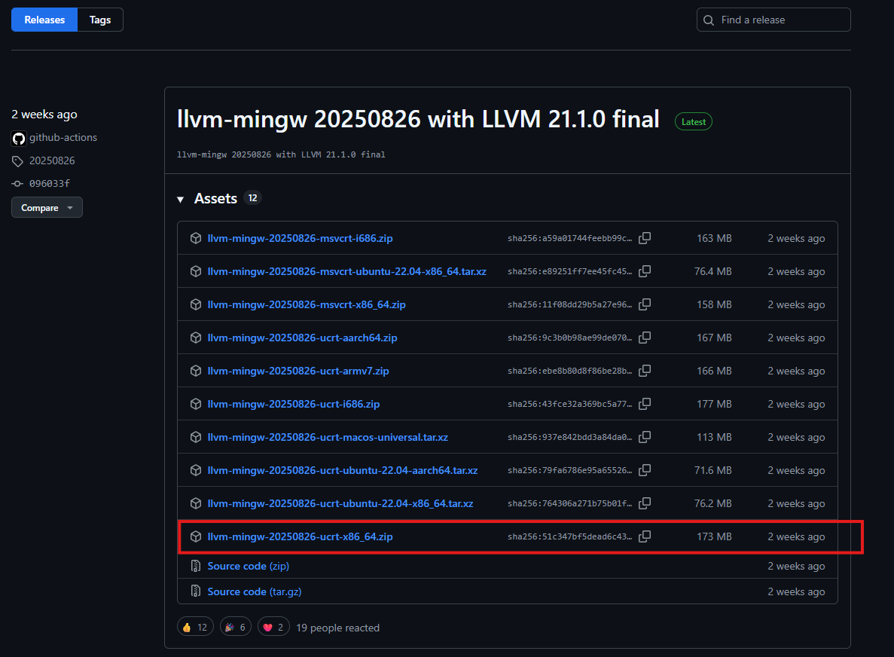
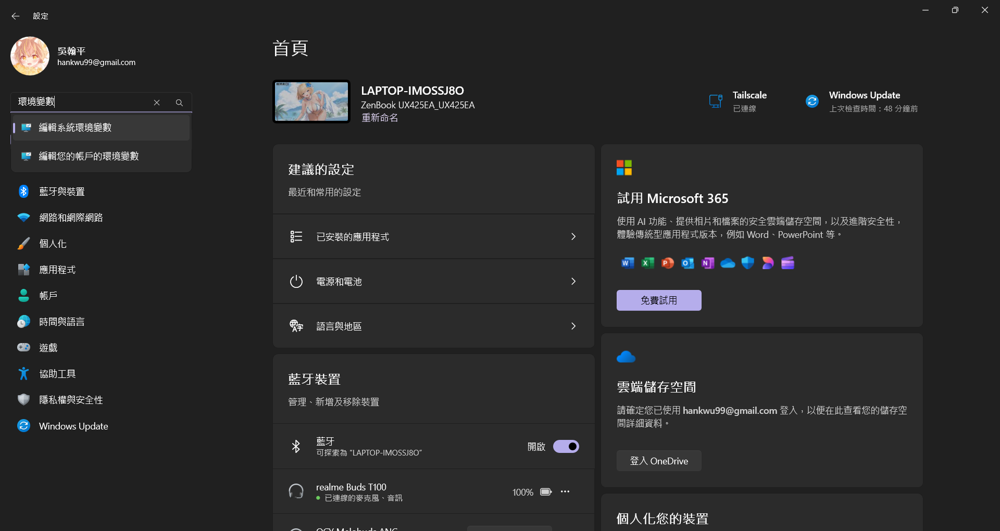
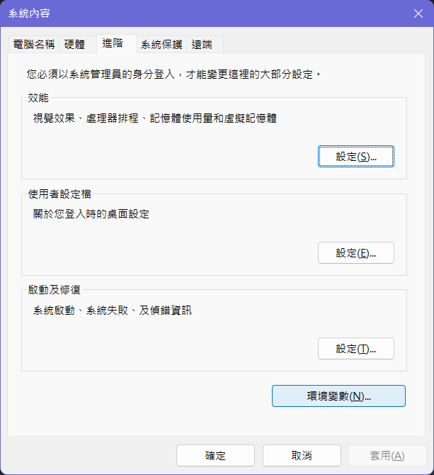
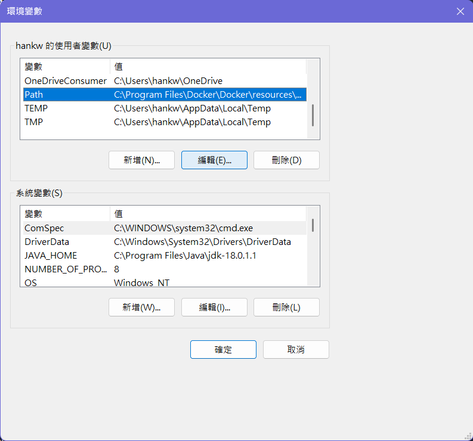
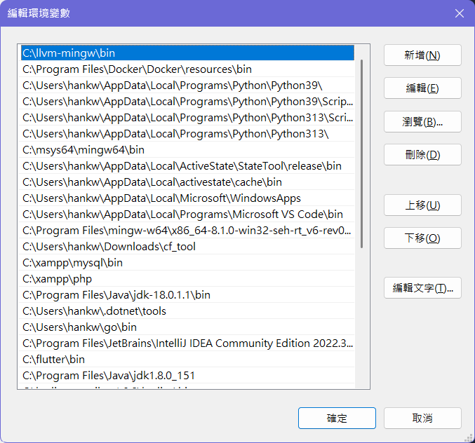
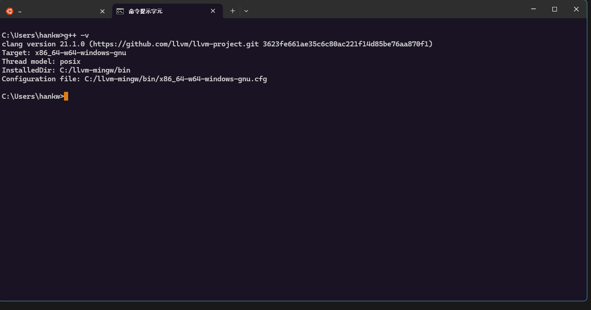
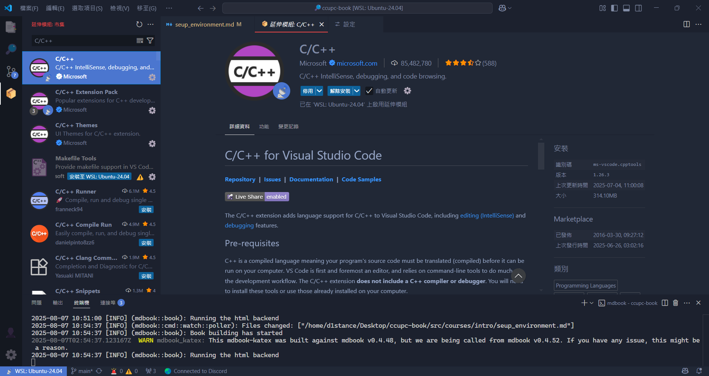
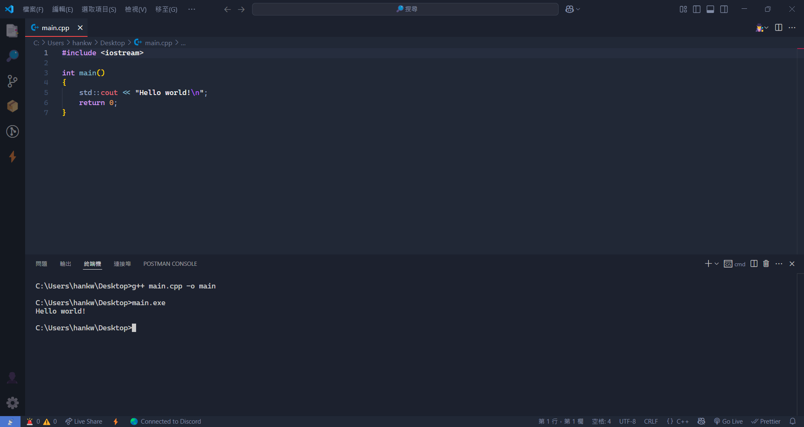

# 環境設置

~~~admonish note title="作者"
D1stance (吳翰平)
~~~

在開始寫 C++ 程式之前，我們需要設置好開發環境，
原因是我們的電腦其實讀不懂 C++ 程式碼，
我們需要一個工具——**編譯器**，
它可以將我們寫的 C++ 程式碼轉換成電腦可以理解的機器碼，
然後電腦才能執行這些程式。

筆者假設大部分的讀者皆是剛入門程式設計的同學，
這裡介紹的第一種方法 [CP Editor](#cp-editor) 比較簡單，不用過多的設定，
但只適用於程式競賽課程，如果你之後也有打算寫其他程式語言，
建議你使用 [Visual Studio Code](#visual-studio-code) 這個編輯器，
它是目前最流行的程式編輯器之一，支援多種程式語言，
並且有許多擴充功能可以使用。

## CP Editor

[CP Editor](https://cpeditor.org/zh_tw/) 是一個專門用於程式競賽的輕量化編輯器，專門為程式競賽設計，因為下載的時候還可以一起把編譯器環境打包好，不用自己設定，所以在這裡介紹給初學者使用，這個軟體同時也是南臺灣學生資訊社群 (SCIST) 的指定編輯器。

### 安裝 CP Editor

1. 前往 [CP Editor 官方網站](https://cpeditor.org/zh_tw/)。
2. 點擊「下載軟體」按鈕，選擇適合你作業系的版本（Windows、macOS 或 Linux）。
3. 選擇帶有 `with-gcc` 字樣的安裝檔進行下載

4. 下載完成後，去到下載的資料夾雙擊安裝檔，按照指示完成安裝。   

安裝完畢之後就可以開始使用 CP Editor 了。

### 設定 CP Editor

1. 打開 CP Editor，點擊左上角的 "Options" > "Preferences"。

2. 選擇 "Appearance" > "General"，選擇 "正體中文" 作為語言。

3. 重開 CP Editor，你會看到介面已經變成中文了。接著我們回到 "選項" > "偏好設定"，在 "動作" > "測資" 中，勾選測資輸入為空時仍然執行。

4. 套用後回到主畫面，點擊左上角的 "檔案" > "新檔案"，按下 `Ctrl + S` 儲存檔案，將檔案命名為 `main.cpp`，這是 C++ 的標準檔案名稱，放在一個你想要的資料夾中。
5. 將範例程式碼複製到 `main.cpp` 中：

```cpp
#include <iostream>

int main()
{
    std::cout << "Hello world!\n";
    return 0;
}
```
6. 點擊編譯並執行按鈕，CP Editor 會自動編譯並執行你的程式，並在右方的輸出視窗中顯示結果。

7. 如果一切順利，你應該會看到輸出結果為 `Hello world!`。

至此，你已經成功設置了 CP Editor 開發環境，
並且可以開始寫 C++ 程式了。

~~~admonish caution title="注意"
如果你使用 Windows 系統，有時候防毒軟體會誤判 C++ 編譯產生的執行檔為
病毒，這是因為 C++ 編譯器會生成一個可執行檔，這個檔案有時候會被防毒軟體誤判為病毒，我建議大家選擇一個資料夾 (假設是桌面上某個 `cpp_learning` 資料夾)，然後點開 `Windows 安全性` 的防毒軟體設定，將這個資料夾加入白名單，這樣就不會被誤判了。
1. 點擊 `病毒與威脅防護` > `病毒與威脅防護設定` > `管理設定`。

2. 在 `排除項目` 中點擊 `新增或移除排除項目`。
3. 將剛剛建立的 `cpp_learning` 資料夾加入排除項目。

這樣就可以避免防毒軟體誤判 C++ 編譯器生成的執行檔為病毒了。
~~~

## Visual Studio Code

Visual Studio Code (下稱 VS Code) 是一個由微軟開發的免費開源程式碼編輯器，支援多種程式語言，包括 C++。它有許多強大的功能，如語法高亮、程式碼補全、除錯等。但因為 VS Code 本身並不包含 C++ 編譯器，所以我們需要額外安裝一些東西來讓它能夠編譯和執行 C++ 程式。

### 安裝 LLVM MinGW

LLVM MinGW 是一個 C++ 編譯器，是一個支援跨平台的編譯器，剛才的 CP Editor 就是使用這個編譯器來編譯 C++ 程式的，
但是因為 VS Code 本身並不包含 C++ 編譯器，所以我們需要額外安裝 LLVM MinGW。

1. 前往 [LLVM MinGW GitHub 頁面](https://github.com/mstorsjo/llvm-mingw/releases) 下載最新版本的 Prebuilt LLVM MinGW。
2. 找到 "Latest" 字樣的版本，點擊進入，尋找對應你作業系統的壓縮檔案，這裡以 Windows 為例，下載 `llvm-mingw-<version>-x86_64.zip`。

3. 直接解壓縮後放到你想要的資料夾中，例如 `C:\llvm-mingw`。
4. 接著需要將 LLVM MinGW 的 `bin` 資料夾加入系統的環境變數中，這樣 VS Code 才能找到編譯器。
   - 在 Windows 中，進入設定面板，搜尋 「環境變數」。
   
   - 在對話框中，點擊「環境變數」。
   
   - 在「系統變數」區域，找到名為 `Path` 的變數，選擇它並點擊「編輯」。
   
   - 點擊「新增」，然後輸入 LLVM MinGW 的 `bin` 資料夾的路徑，例如 `C:\llvm-mingw\bin`。
   
   - 點擊「確定」保存更改。
5. 為了確保環境變數生效，建議重新啟動電腦，接著打開命令提示字元 (CMD)，輸入 `g++ --version`，如果顯示出版本資訊，表示 LLVM MinGW 安裝成功。


### 安裝 Visual Studio Code

1. 前往 [Visual Studio Code 官方網站](https://code.visualstudio.com/) 進行下載
2. 點擊「Download for Windows」按鈕，下載適合你作業系統的安裝檔。
3. 下載完成後，雙擊安裝檔，按照指示完成安裝。
4. 因為 VS Code 也會新增一些環境變數，所以建議重新啟動電腦。
5. 打開 VS Code，點擊左側的擴充功能圖示 (Extensions)，搜尋 `C/C++`，安裝由 Microsoft 提供的 C/C++ 擴充套件。

6. 接著新增一個 C++ 檔案，點擊左上角的「檔案」>「新檔案」，將檔案儲存為 `main.cpp`。
7. 將範例程式碼複製到 `main.cpp` 中：
```cpp
#include <iostream>
int main()
{
    std::cout << "Hello world!\n";
    return 0;
}
```
8. 接著按下 `Ctrl + ‵`，開啟終端機，然後輸入以下指令來編譯程式：
```bash
g++ main.cpp -o main
```
這個指令會將 `main.cpp` 編譯成一個可執行檔 `main.exe`。
9. 編譯完成後，輸入以下指令來執行程式：
```bash
main.exe
```

如果一切順利，你應該會看到輸出結果為 `Hello world!`。

到此，你已經成功設置了 Visual Studio Code 開發環境，
並且可以開始寫 C++ 程式了。