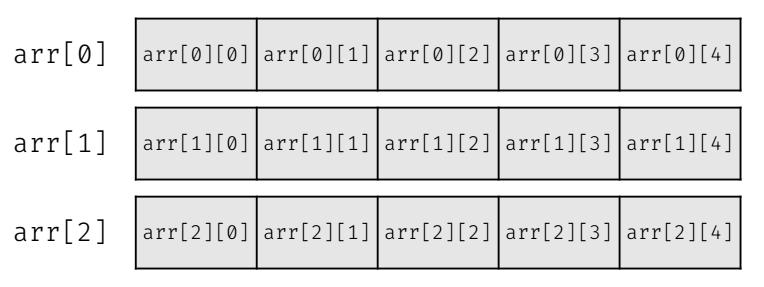
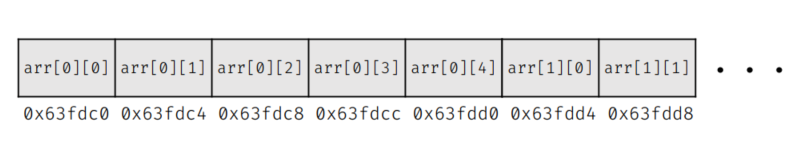
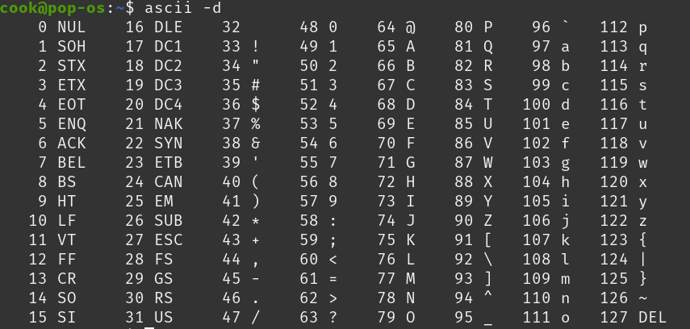

# 指標與字串

> 作者: **D1stance** 

## 指標

一個一般的變數有名稱、型態、值。

如果現在有三個變數：

```c++
int i = 5;
double d = 3.14;
bool b = true;
```


| 名稱 | 型態  | 值    |
| ---- | ----- | ----- |
| i    | int   | 5     |
| d    | double| 3.14  |
| b    | bool  | true  |

這些變數都會放在記憶體的某個位置，我們會稱這些位置為「位址」。

| 名稱 | 型態  | 位址     | 值    |
| ---- | ----- | -------- | ----- |
| i    | int   | 0x7ffdfb8c | 5     |
| d    | double| 0x7ffdfb90| 3.14  |
| b    | bool  | 0x7ffdfb98| true  |

這個變數位址我們會用一個十六進位的數字來表示。

### 十六進位

十六進位是以 16 為基數的數字系統，使用 0-9 和 A-F 來表示數字。
- 0-9 表示數字 0 到 9
- A 表示 10
- B 表示 11
- C 表示 12
- D 表示 13
- E 表示 14
- F 表示 15

當一個數字有前綴 `0x` 時，表示這個數字是十六進位的。
剛才變數 `i` 的位址 `0x7ffdfb8c`，就是一個十六進位的數字，
因為一個 int 變數佔有 4 個位元組 (Bytes)，
所以 `0x7ffdfb8c` 這個位址的下一個變數的位址是 `0x7ffdfb90`，
而 `0x7ffdfb90` 的下一個變數的位址是 `0x7ffdfb98`，
這是因為 double 佔有 8 個位元組。

### 指標

指標是一種特別的變數，用來儲存其他變數的位址。

我們可以宣告一個指標變數來儲存 `i` 的位址：

```c++
int *ptr = &i;
```

`*` 表示這是一個指標變數，

這裡的 `&` 運算子是取位址運算子，它會返回變數 `i` 的位址，

指標變數 `ptr` 的型態是 `int*`，表示它是一個指向 `int` 型態的指標，

指標變數 `ptr` 現在儲存了 `i` 的位址 `0x7ffdfb8c`。
| 名稱 | 型態   | 位址     | 值    |
| ---- | ------ | -------- | ----- |
| i    | int    | 0x7ffdfb8c | 5     |
| ptr  | int*   | 0x7ffdfb99 | 0x7ffdfb8c |

指標有以下這幾種宣告的方式：
```c++
int *ptr;
int* ptr;
int * ptr;
```

這三種方式都是合法的，指標的型態是 `int*`，而 `ptr` 是指標變數的名稱，

如果有多個指標變數，可以這樣宣告：

```c++
int *ptr1, *ptr2, *ptr3;
```

你會發現，`*` 會出現在每個指標變數的前面，所以通常而言用第一種宣告方式會比較清楚。

如果你寫成這樣
```c++
int *ptr1, ptr2, ptr3;
```

這樣的話，`ptr1` 是一個指標變數，而 `ptr2` 和 `ptr3` 是一般的 `int` 變數。

而取位址運算子 `&` 也可以單獨使用，不一定要搭配指標：
```c++
int i = 5;
cout << (&i) << '\n'; // 這樣會輸出 i 的位址
```

### 間接運算子 `*`

間接運算子 `*` 用來取得指標所指向的變數的值，也可以用它來實際更改指標所指向的變數的值。

```c++
int i = 5;
int *ptr = &i;
cout << *ptr << '\n'; // 這樣會輸出 i 的值 5
*ptr = 10; // 這樣會把 i 的值改成 10
cout << i << '\n'; // 這樣會輸出 i 的值 10
```

一般而言，我們複製變數之後，修改被複製的變數不會影響原本的變數，

```c++
int a = 5;
int b = a; // 複製 a 的值到 b
b = 10; // 修改 b 的值
cout << a << '\n'; // 這樣會輸出 a 的值 5
```

但如果我們使用指標，因為紀錄的是變數實際上在記憶體中的位址，
所以我們是直接對記憶體進行操作，
這樣就可以直接修改原本的變數。

我們也可以結合取址運算子 `&` 和間接運算子 `*` 來做操作：

```c++
int num = 10;
*(&num) = 20; // 這樣會把 num 的值改成 20
cout << num << '\n'; // 這樣會輸出 num 的值 20
```

### 雙重指標

既然指標是用來儲存其他變數的位址，那麼指標本身也可以有自己的位址，
所以指向指標的地址的變數就是雙重指標。

```c++
int i = 5;
int *ptr = &i; // ptr 是指向 i 的指標
int **dptr = &ptr; // dptr 是指向 ptr 的雙重指標
```

| 名稱 | 型態    | 位址     | 值        |
| ---- | ------- | -------- | --------- |
| i    | int     | 0x7ffdfb8c | 5         |
| ptr  | int*    | 0x7ffdfb99 | 0x7ffdfb8c |
| dptr | int**   | 0x7ffdfb9d | 0x7ffdfb99 |

### 多重指標的口訣

在很多 `*` 疊加下，你可能會分不清楚現在操作的對象究竟是一個值還是一個位址，
這裡筆者提供一個競程創隊元老壯滋學長的口訣：

1. 把宣告時的型態補在前面
2. 剩下的部分就是遮起來的部分之值

這樣可能有點模糊，我們提供一個例子幫助理解：

```c++
int i = 5;
int *ptr = &i; // ptr 是指向 i 的指標
int **dptr = &ptr; // dptr 是指向 ptr 的雙重指標
int ***tptr = &dptr; // tptr 是指向 dptr 的三重指標
int ****fptr = &tptr; // fptr 是指向 tptr 的四重指標
```

現在有一個操作的對象是 `*fptr`，我們可以這樣理解：  

先把原本的 `int ****` 的型態寫上去，

變成 `int ****fptr` 你想知道 `*fptr` 的值是什麼，

就把 `*fptr` 遮起來，剩下的部分是 `int ***`，所以 `*fptr` 的值是 `int ***` 的值，也就是 `tptr` 的值。

### 參考 Reference `&`

參考是一個 C++ 特有的概念，有點像是幫變數創造一個別名，
這樣就可以用別名來操作原本的變數，
參考的宣告方式是使用 `&` 符號：

```c++
int i = 5;
int &ref = i; // ref 是 i 的參考
ref = 10; // 這樣會把 i 的值改成 10
cout << i << '\n'; // 這樣會輸出 i 的值 10
```

參考有幾個特點：
1. 參考宣告時一定要指定一個已經存在的變數，不能宣告一個沒有初始值的參考。
2. 宣告後不能修改指定的變數，參考一旦與變數綁定，就不能再改變。
3. 參考不佔用額外的記憶體空間，它只是原變數的別名。

| 取址運算子 `&` | 參考 `&` |
| --------------- | --------- |
| 用來取得變數的位址 | 用來創建變數的別名 |

只有宣告的時候在型態加上的 `&` 是參考，其他地方的 `&` 都是取址運算子。

### 小練習

```c++
int a = 10;
int b = 5;
int *c = &a;
b += *c;
*c = 12;
cout << a << " " << b << '\n';
```

<details><summary> 答案 </summary>
12 15
</details>


## 陣列與指標

當我們宣告了一個陣列 `int arr[5];`，

這個陣列的名稱 `arr` 在大部分的時候除了代表陣列以外，有時也會轉型為指向陣列第一個元素的指標。

這意味著 `arr` 可以被視為一個指向 `int` 的指標，指向陣列的第一個元素。

如果你對 `arr` 使用取址運算子 `&`，你會得到陣列的位址：

```c++
int arr[5] = {1, 2, 3, 4, 5};
cout << arr << '\n'; // 這樣會輸出陣列的位址
cout << &arr << '\n'; // 這樣也會輸出陣列的位址
```

這兩個輸出是相同的，因為 `arr` 和 `&arr` 都指向陣列的第一個元素。
不過，陣列的名稱 `arr` 並不是一個指標變數，它不能被重新指派到其他位址。

如果你對 `arr + 1` 使用取址運算子 `&`，你會得到陣列第二個元素的位址：

```c++
cout << (arr + 1) << '\n'; // 這樣會輸出陣列第二個元素的位址
```

這是因為 `arr + 1` 會指向陣列的第二個元素，這個位址是 `arr` 的位址加上 `sizeof(int)` 的大小。
如果你想要取得陣列的第一個元素的值，可以使用間接運算子 `*`：

```c++
cout << *arr << '\n'; // 這樣會輸出陣列第一個元素的值
```

如果你想要取得陣列的第二個元素的值，可以使用 `*(arr + 1)`：

```c++
cout << *(arr + 1) << '\n'; // 這樣會輸出陣列第二個元素的值
```

以此類推，因此 `arr[i]` 可以被視為 `*(arr + i)`。

那麼二維陣列呢?

假設我們有一個二維陣列 `arr[3][5]`，這個陣列有 3 行 5 列。



二維陣列其實在記憶體中是連續存放的，



因此，這時候 `arr` 的第一個元素，會是一個長度為 5 的一維陣列 `arr[0]`，
而 `arr[0]` 的第一個元素 `arr[0][0]` 會是 `arr[0]` 的第一個元素。

所以我們可以推出下列的關係：

```c++
arr[i][j]
== *(*(arr + i) + j)
== *(*(&arr[i]) + j)
== *(arr[i] + j)
== *(&arr[i][j])
```

### 練習題

#### 第一題

```c++
#include<bits/stdc++.h>
using namespace std;
int main(){
    int a;
    int *b;
    a = 4;
    b = &a;
    cout << ++*b << " " << a;
}
```

<details><summary> 答案 </summary>
5 5
</details>

#### 第二題

```c++
#include<bits/stdc++.h>
using namespace std;
int main(){
    int a = 1;
    int *b, *c;
    b = &a;
    c = &a;
    *b = 2;
    *c = 3;
    cout << a;
}
```

<details><summary> 答案 </summary>
3
</details>

#### 第三題

```c++
#include<bits/stdc++.h>
using namespace std;
int main(){
    int a = 10;
    int b = 5;
    int *c = &a;
    int **d = &c;
    *c = 8;
    *d = &b;
    *c = 12;
    *d = &a;
    **d -= 2;
    cout << a << " " << b;
}
```

<details><summary> 答案 </summary>
6 12
</details>

## 字元與字串

### 字元

字元是一種用來儲存語言資料 (字母、數字、符號等) 的資料型態，
佔有 1 個位元組 (Byte)，每個字元都有一個對應的 ASCII 碼。
例如，字母 'A' 的 ASCII 碼是 65，'B' 的 ASCII 碼是 66。



在上表中，0 ~ 31 和 127 是不可顯示的控制字元，
而 32 ~ 126 是可顯示的字元。

我們可以使用標準輸出入流來輸出字元：

```c++
#include <iostream>
using namespace std;

int main()
{
    char c = 'A'; // 宣告一個字元變數 c
    cout << c << '\n'; // 輸出字元 c
    cout << (int)c << '\n'; // 輸出字元 c 的 ASCII 碼
    char d;
    cin >> d; // 從標準輸入讀取一個字元
    cout << d << '\n'; // 輸出讀取的字元
    cout << (int)d << '\n'; // 輸出讀取的字元的 ASCII 碼
    return 0;
}
```

因為字元本身其實就是數字，所以也可以用來做基礎的加減和比較運算：

```c++
#include <iostream>
using namespace std;
int main()
{
    char c = 'A';
    cout << c + 1 << '\n'; // 輸出 'B'
    cout << c - 1 << '\n'; // 輸出 '@'
    cout << c < 'B' << '\n'; // 輸出 1 (true)
    cout << c > 'B' << '\n'; // 輸出 0 (false)
    return 0;
}
```

#### cctype
C++ 提供了一些函式來處理字元，這些函式定義在 `<cctype>` 標頭檔中。
這些函式可以用來檢查字元的類型，例如是否為數字、字母、空白等。

```c++
isdigit(c) // 檢查 c 是否為數字
isalpha(c) // 檢查 c 是否為字母
isspace(c) // 檢查 c 是否為空白字元
islower(c) // 檢查 c 是否為小寫字母
isupper(c) // 檢查 c 是否為大寫字母

// 下列兩個函式用來轉換字元的大小寫，會回傳 ASCII 碼
tolower(c) // 將 c 轉換為小寫字母
toupper(c) // 將 c 轉換為大寫字母
```

範例
```c++
#include <iostream>
#include <cctype>
using namespace std;

int main()
{
    cout << isdigit('5') << '\n'; // 1 (true)
    cout << isalpha('A') << '\n'; // 1 (true)
    cout << toupper('a') << '\n'; // 65
    return 0;
}
```

### 字串

#### 字元陣列

字串其實就是很多的字，那麼就會是一個字元陣列，
我們可以這樣宣告一個字元陣列：

```c++
char str[6] = "Hello"; // 字串長度為 5，最後一個字元是 '\0'
```

特別的是，字元陣列最後需要有一個特殊的字元 `'\0'`，這個字元稱為「字串結束符號」，用來標記字串的結尾。
這樣我們就可以用 `cout` 輸出字串：

```c++
#include <iostream>
using namespace std;
int main()
{
    char str[6] = "Hello"; // 字串長度為 5，最後一個字元是 '\0'
    cout << str << '\n'; // 輸出字串
    return 0;
}
```

這裡有一個問題是，如果我們宣告的字元陣列長度不夠，
那麼可能會輸出奇怪的結果，因為沒有足夠的空間來存放 `'\0'`。

##### fgets

一般的 `cin` 只能讀取到空白字元為止，空白後的字串就會被視為新的輸入或者被忽略，
如果我們想要讀取包含空白的字串，可以使用 `fgets` 函式：

```c++
#include <iostream>
#include <cstdio> // 包含 fgets 函式
using namespace std;
int main()
{
    char str[100]; // 宣告一個字元陣列
    fgets(str, 10, stdin); // 從標準輸入讀取字串
    cout << str; // 輸出字串
    return 0;
}
```

要注意的事情是，第二個參數是字元陣列的大小，
還有不能跟 `cin` 一起使用，
因為 `cin` 會清除緩衝區中的換行字元。
以及他會把讀到的換行字元 `\n` 也包含在字串中，
如果不想要換行字元，可以在輸出前手動去掉：

```c++
str[strlen(str) - 1] = '\0'; // 去掉最後的換行字元
```

`strlen` 是一個 `<cstring>` 標頭檔中的函式，用來計算字串的長度，
回傳值不包含結束符號 `'\0'`。

`cstring` 標頭檔還提供了其他一些有用的函式來處理字串，例如：
- `strcpy` 用來複製字串
- `strcat` 用來連接字串
- `strcmp` 用來比較字串

首先講回 `strlen`，他有點像是你想知道一本書的頁數，
就從第一頁開始數，直到最後一頁的結束符號，
這樣就可以知道這本書有多少頁。

所以不建議放在迴圈中的判斷式，可能會造成超時。

```c++
#include <iostream>
#include <cstring> // 包含 strlen 函式
using namespace std;
int main()
{
    char str[100]; // 宣告一個字元陣列
    cin >> str;
    for(int i = 0; i < strlen(str); i++) // 使用 strlen 計算字串長度
        cout << str[i] << " "; // 輸出每個字元
    cout << '\n';
```

上面這個就是一個不好的範例，因為 `strlen` 會在每次迴圈中都計算一次字串長度，
這樣會造成不必要的計算，尤其是當字串很長時，會影響效能。
因此，建議在迴圈外先計算一次字串長度，然後在迴圈中使用這個長度：

```c++
#include <iostream>
#include <cstring> // 包含 strlen 函式
using namespace std;
int main()
{
    char str[100]; // 宣告一個字元陣列
    cin >> str;
    int len = strlen(str); // 在迴圈外計算一次字串長度
    for(int i = 0; i < len; i++) // 使用計算好的長度
        cout << str[i] << " "; // 輸出每個字元
    cout << '\n';
}
```

畢竟字串長度不會改變，所以只需要計算一次就可以了。

##### strcpy

`strcpy` 用來複製字串，語法如下：

```c++
char *strcpy(char *dest, const char *src);
```

`dest` 是目標字串，`src` 是來源字串，這個函式會把 `src` 的內容複製到 `dest` 中。

```c++
#include <iostream>
#include <cstring> // 包含 strcpy 函式
using namespace std;
int main()
{
    char str1[100] = "Hello"; // 來源字串
    char str2[100]; // 目標字串
    strcpy(str2, str1); // 複製 str1 到 str2
    cout << str2 << '\n'; // 輸出目標字串
    return 0;
}
```

但要注意的事情是，`strcpy` 不會檢查目標字串的大小，
如果目標字串的大小不夠，可能會導致緩衝區溢位 (Buffer Overflow)，
簡單來說就是目標字串的空間不夠大，會導致寫入超出範圍的記憶體。
因此在使用 `strcpy` 時，必須確保目標字串有足夠的空間來存放來源字串。

##### strcat
`strcat` 用來連接兩個字串，語法如下：

```c++
char *strcat(char *dest, const char *src);
```

`dest` 是目標字串，`src` 是來源字串，這個函式會把 `src` 的內容連接到 `dest` 的末尾。

```c++
#include <iostream>
#include <cstring> // 包含 strcat 函式
using namespace std;
int main()
{
    char str1[100] = "Hello"; // 來源字串
    char str2[100] = " World"; // 目標字串
    strcat(str1, str2); // 將 str2 連接到 str1
    cout << str1 << '\n'; // 輸出連接後的字串
    return 0;
}
```

跟 `strcpy` 一樣，`strcat` 也不會檢查目標字串的大小，
如果目標字串的大小不夠，可能會導致緩衝區溢位 (Buffer Overflow)。

##### strcmp

`strcmp` 用來比較兩個字串，語法如下：

```c++
int strcmp(const char *str1, const char *str2);
```

`str1` 和 `str2` 是要比較的兩個字串，這個函式會返回一個整數值，
- 如果 `str1` 小於 `str2`，則返回負值
- 如果 `str1` 等於 `str2`，則返回 0
- 如果 `str1` 大於 `str2`，則返回正值

這個函數會從第一個字元開始一一比較，
直到遇到不同的字元或是結束符號 `'\0'` 為止。

比較的結果是根據字元的 ASCII 碼來決定的，
假設一樣都是小寫，則照 `a` 到 `z` 的順序比較，
如果一個大寫一個小寫，則大寫會被視為小於小寫，
這種順序又被稱為 `字典序` (Lexicographical Order)。


#### C++ 字串類別

Character array 比較像是 C 語言的做法，
C++ 提供了一個更方便的字串類別 `std::string`，
這個類別提供了許多方便的函式來處理字串。

我們有以下幾種宣告 `std::string` 的方式：

```c++
string str1; // 宣告一個空的字串
string str2 = "Hello"; // 宣告並初始化字串
string str3("World"); // 使用括號初始化字串
string str4 = str2; // 複製字串
string str5 = char_array; // 從字元陣列初始化字串
```

輸入和輸出字串可以直接使用 `cin` 和 `cout`：

```c++
#include <iostream>
#include <string> // 包含 string 類別
using namespace std;
int main()
{
    string str; // 宣告一個字串變數
    cin >> str; // 從標準輸入讀取字串
    cout << str << '\n'; // 輸出字串
    return 0;
}
```

一樣的問題，`cin` 會在遇到空白字元時停止讀取，
如果想要讀取包含空白的字串，可以使用 `getline` 函式：

```c++
#include <iostream>
#include <string> // 包含 string 類別
using namespace std;
int main()
{
    string str; // 宣告一個字串變數
    getline(cin, str); // 從標準輸入讀取包含空白的字串
    cout << str << '\n'; // 輸出字串
    return 0;
}
```

`getline` 會讀取整行輸入，直到遇到換行字元為止，
不同的於 `fgets`，`getline` 不會包含換行字元，
特別的是，我們也可以調整他要遇到什麼字元才停止讀取：

```c++
#include <iostream>
#include <string> // 包含 string 類別
using namespace std;
int main()
{
    string str; // 宣告一個字串變數
    getline(cin, str, ','); // 從標準輸入讀取字串，直到遇到逗號為止
    cout << str << '\n'; // 輸出字串
    return 0;
}
```

這樣就可以讀取到逗號前的字串。
而且不需要指定字串的大小，因為 `std::string` 會自動管理記憶體。

##### cin.ignore

在使用 `getline` 之前，如果之前有使用過 `cin`，
這樣可能會導致 `getline` 讀取到換行字元，
這是因為 `cin` 不會讀取空白跟換行字元，
所以如果之前有使用過 `cin`，那麼緩衝區中可能還有換行字元。
為了解決這個問題，我們可以使用 `cin.ignore()` 函式來忽略緩衝區中的換行字元：

```c++
#include <iostream>
#include <string> // 包含 string 類別
using namespace std;

int main()
{
    int n; // 宣告一個整數變數
    cin >> n; // 從標準輸入讀取整數
    cin.ignore(); // 忽略緩衝區中的換行字元
    for(int i = 0; i < n; ++i)
    {
        string str; // 宣告一個字串變數
        getline(cin, str); // 從標準輸入讀取包含空白的字串
        cout << str << '\n'; // 輸出字串
    }
}
```

這樣就可以正確地讀取包含空白的字串了。

`std::string` 提供了許多方便的函式來處理字串，例如：
- `length()` 或 `size()`：返回字串的長度
- `empty()`：檢查字串是否為空
- `clear()`：清空字串
- `append()` 或 `+=`：連接字串

更多函式可以參考 [C++ Reference](https://en.cppreference.com/w/cpp/string/basic_string)。

不同於 `strlen`，`std::string` 的長度可以直接使用 `length()` 或 `size()` 函式來取得，而且它是早就記錄好的值，因此不會有一直翻書的問題。

#### 字串與數字的轉換

如果現在你有一個數字字串，想要把它轉換成整數或浮點數，
你字串是 char array 的話，可以使用 `atoi` 或 `atof` 函式：

```c++
#include <iostream>
#include <cstdlib> // 包含 atoi 和 atof 函式
using namespace std;
int main()
{
    char str[] = "123"; // 數字字串
    int num = atoi(str); // 將字串轉換為整數
    cout << num << '\n'; // 輸出整數
    double dnum = atof(str); // 將字串轉換為浮點數
    cout << dnum << '\n'; // 輸出浮點數
    return 0;
}
```

如果你使用 `std::string`，可以使用 `stoi` 或 `stod` 函式：

```c++
#include <iostream>
#include <string> // 包含 string 類別
using namespace std;
int main()
{
    string str = "123"; // 數字字串
    int num = stoi(str); // 將字串轉換為整數
    cout << num << '\n'; // 輸出整數
    double dnum = stod(str); // 將字串轉換為浮點數
    cout << dnum << '\n'; // 輸出浮點數
    return 0;
}
```

這些函式會自動處理字串中的空白字元和其他非數字字元。

## Stringstream

字串流是 C++ 獨有的強大工具，
可以用來在字串和其他資料型態之間進行轉換，
它定義在 `<sstream>` 標頭檔中。

字串流可以用來讀取和寫入字串，就像使用 `cin` 和 `cout` 一樣，
但它是針對字串進行操作，而不是標準輸入輸出。

```c++
#include <iostream>
#include <sstream> // 包含 stringstream 類別
using namespace std;
int main()
{
    string str = "123 456 789"; // 數字字串
    stringstream ss(str); // 建立字串流
    int num;
    while(ss >> num) // 從字串流讀取整數
        cout << num << '\n'; // 輸出整數
    return 0;
}
```

上面的程式碼會將字串中的數字分別讀取出來，
並輸出每個數字。

字串流也可以用來將其他資料型態轉換為字串：

```c++
#include <iostream>
#include <sstream> // 包含 stringstream 類別
using namespace std;
int main()
{
    int num = 123; // 整數
    stringstream ss; // 建立字串流
    ss << num; // 將整數寫入字串流
    string str = ss.str(); // 從字串流取得字串
    cout << str << '\n'; // 輸出字串
    return 0;
}
```

stringstream 如果需要清空，需要同時使用 `str("")` 和 `clear()`：

```c++
#include <iostream>
#include <sstream> // 包含 stringstream 類別
using namespace std;
int main()
{
    stringstream ss; // 建立字串流
    ss << "Hello, World!"; // 寫入字串
    cout << ss.str() << '\n'; // 輸出字串
    ss.str(""); // 清空字串流的內容
    ss.clear(); // 清除錯誤狀態
    cout << "After clearing: " << ss.str() << '\n'; // 輸出清空後的字串
    return 0;
}
```

## 小結

在這一章中，我們學習了 C++ 中的指標、參考、字元和字串的基本概念，
以及如何使用指標和參考來操作變數的位址。
我們還學習了如何使用字串類別 `std::string` 來處理字串，
以及如何使用字串流 `stringstream` 來在字串和其他資料型態之間進行轉換。
這些概念在 C++ 中非常重要，因為它們可以幫助我們更有效地管理記憶體和處理資料。

## 題單

- [CSES 1755 - String Reorder](https://cses.fi/problemset/task/1755)
- [Atcoder ABC 381 A](https://atcoder.jp/contests/abc381/tasks/abc381_a)
- [Atcoder ABC 053 B](https://atcoder.jp/contests/abc053/tasks/abc053_b)

## Reference


- [113 學年度簡報 講師 林子傑](https://drive.google.com/file/d/1z54TcWWK7NPE5w61WaRDhXLPXMdvEbKi/view?usp=sharing)
