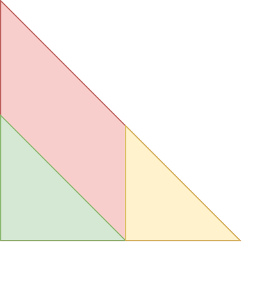
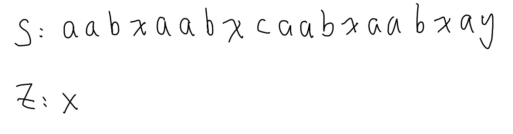
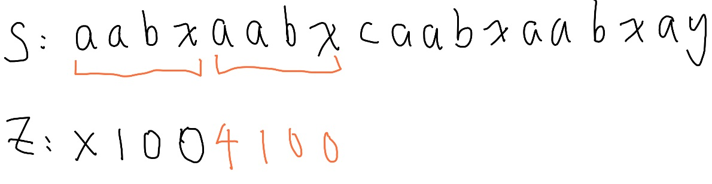
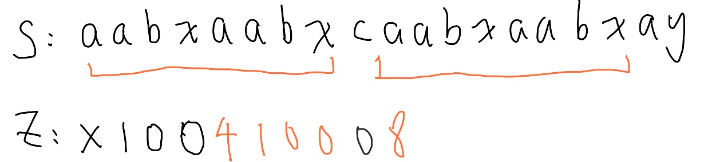
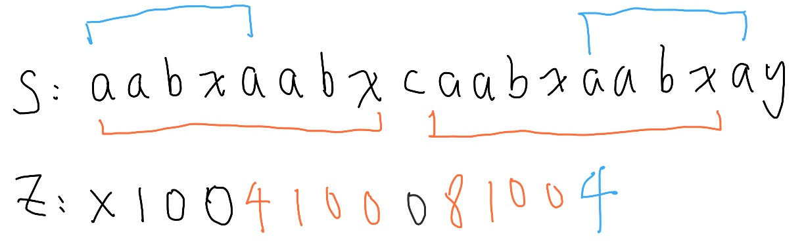
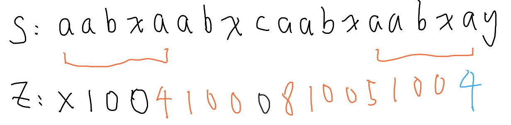

# String Matching

當我們需要比較兩個字串是否一致時，
其實我們就像是在比較兩個數字陣列是否一致，
只是從一般的數字變成 ASCII Code 組成的陣列。

如果我們不在乎順序，這是一個很簡單的問題，我們只要比較每個字元出現次數，
反之，我們只能逐一比較，除了長度不一樣可以明顯區分的情況以外，
需要花費 $O(|S|)$ 的時間比較，在多組比較下時間非常慢，
因此我們需要一些快速的比較方式。

## Hashing

我們第一個想法是比較很多數字太浪費時間了，
可不可以把一串字壓成一個數字？

**回想數字進制的表示法！**
我們其實可以參考數字進位的方式，像是十進位的 $163 = 10^2 \times 1 + 10^1 \times 6 + 10^0 \times 3$，
用類似的方式，找到一個比字元集大小大的數字 $B$，例如只有小寫的話我們取 $29$，
字串 $abaa$ 就可以表示成 $29^3 \times 1 + 29^2 \times 2 + 29^1 \times 1 + 29^0 \times 1$，係數使用 ASCII Code。


這樣有一個問題，假設字串長度是 $10^3$ 甚至 $10^5$，
$29^{1000}$ 我們要如何儲存？即使透過 Python 或者其他語言的大數來處理，
這個所花費的空間仍然是非常驚人的，所以我們希望出來的數字不要太大。

我們可以透過**模除**的方式，將這個結果模除一個數字 $P$，這樣結果的範圍就會被壓縮在 $[0, P)$ 內，
同時因為這個數字的計算過程只用到乘法和加法，
透過模除定理我們可以在計算過程中保證每一步的數值不會太大。
將一串指定內容轉變成數字的函數我們稱為雜湊 (Hashing)，用 $\text{Hash}(S)$ 表示。

接著就產生一個新的問題，如果用大數來存，我們可以保證當兩個結果數字一樣時，
字串內容一定一樣，但是現在還可以嗎？不行，這也是雜湊的問題之一，
因為我們已經限制過輸出的範圍，就有可能兩個以上不一樣的字串算出一樣的結果，
這個情況稱為碰撞 (Collision)。

### 碰撞處理

我們的底數 $B$ 以及模數 $P$，選擇質數。

$B$ 選擇一個略大於字元集合大小的質數，<br>$P$ 選擇接近 $10^9$ 的質數，像是 $10^9 + 7, 10^9 + 9, 998244353$。

如果 $B$ 跟 $P$ 有公因數，那麼 $B^i \bmod P$ 會很快出現重複，
導致很多不同的字串對應到相同的哈希值（碰撞變多）。

舉例：
若 $P = 10, B = 5$
那 $5^1 = 5, 5^2 = 25$, $5^1 \equiv 5^2 \pmod {10}$
若 $B$ 是質數、且與 $P$ 無公因數，$\bmod P$ 後的分布會比較隨機，讓結果更平均、碰撞機率更低。

接著，如果只做一次會碰撞，我們可以選第二個質數 $P'$，做第二次 Hash，每次比較兩個 Hash 值。

```cpp=1
const int B = 29, P = 998244353;
long long hash(const string &s)
{
    long long res = 0;
    int n = s.size();
    for(int i = 0; i < n; ++i)
        res = ((res * B) % P + s[i]) % P;
    // 自己想看看，為何這樣就可以達成我們要的效果，而不需要快速冪。
    return res;
}
```

### Rolling Hash

剛才講的例子是直接比較兩個完整字串 $S, T$ 是否一致，
一個更通用的情況是，在字串 $S$ 中尋找是否有子字串 $T$，或者檢查出現幾次，
我們稱為字串匹配。

我們如果對字串 $S$ 中所有長度為 $T$ 的子字串做 Hashing，然後一一比較，
總時間複雜度為 $O((|S| - |T|) \times |T|) = O(|S| |T|)$，聽起來真的是有夠糟糕的，
但如果我們觀察一下相鄰的兩個長度為 $T$ 的子字串，可以發現一些端倪。

假設我們有字串 $abda$，兩個長度為三的子字串分別為 $abd, bda$，
假設輸出都挺小的，我們都先省略模除的部份，他們的 Hash 分別為

$B^2 \times 1 + B^1 \times 2 + B^0 \times 4$,<br>
$B^2 \times 2 + B^1 \times 4 + B^0 \times 1$，

以及完整字串的 Hash 是

$B^3 \times 1 + B^2 \times 2 + B^1 \times 4 + B^0 \times 1$，

子字串 $bda$ 的 Hash 值剛好是完整字串拿掉 $B^3 \times 1$，
子字串 $abd$ 的 Hash 值剛好是完整字串拿掉 $B^0 \times 1$ 然後同除 $B$，
講到這裡，你應該有發現子字串的雜湊值，可以透過類似於前綴和抵銷的方式快速算出來，
因為消掉前面比起消掉後面多餘的好做。

我們計算好字串 $abda$ 的五個前綴 hash 值：<br>
$\text{prefHash}(S[0]) = 0$<br>
$\text{prefHash}(S[1]) = B^0 \times 1$<br>
$\text{prefHash}(S[2]) = B^1 \times 1 + B^0 \times 2$<br>
$\text{prefHash}(S[3]) = B^2 \times 1 + B^1 \times 2 + B^0 \times 4$<br>
$\text{prefHash}(S[4]) = B^3 \times 1 + B^2 \times 2 + B^1 \times 4 + B^0 \times 1$


在圖形上來看會呈現一個三角形，所以被消去的部份要往上放大。

子字串 $abd$ 的 $\text{Hash}(S[1:3])$ 就是 $\text{prefHash}(S[3]) - \text{prefHash}(S[0]) \times B^{3-1+1}$<br>
子字串 $bda$ 的 $\text{Hash}(S[2:4])$ 就是 $\text{prefHash}(S[4]) - \text{prefHash}(S[1]) \times B^{4-2+1}$

至此，如果我們存下每一個前綴 Hash 值，可以在 $O(1)$ 時間算出所有子字串的 Hash 值，
記得要加上模除，因為有減法，出來可能有負值，記得先模除再加上 $P$ 轉回 $[0,P)$，
另外 $B^i$ 可以在一開始邊做前綴 hash 的時候存下來，這樣就不用快速冪了。

### 結論

字串 Hash 就是最簡單但不穩定的作法，
之後介紹的演算法就是穩定的做法，
但只會雜湊也夠打天下了。

## Knuth–Morris–Pratt (KMP) 

在介紹另外一個作法之前，我們可以來看看暴力版本的字串匹配會怎麼做

| Rounds | a | b | a | b | c | a | b | a | b | d | 
| - | - | - | - | - | - | - | - | - | - | - |
| 1 | a | b | a | b | d  |  |   |  | | 
| 2 |  | a | b | a | b | d |  |   |  | |
| 3 |  |  | a | b | a | b | d |   |  | |
| 4 |  |  |  | a | b | a | b | d  |  | |
| 5 |  |  |  |  | a | b | a | b | d   | | 
| 6 |  |  |  |  |  |a | b | a | b | d  | 


我們會把兩個字串對齊，一一比較，遇到不符合的就把字串往後移動一格，然後繼續從頭比較，
這樣時間複雜度也是 $O(|S||T|)$。

這樣實在是太慢了！其實在配對 "ababc" 失敗之後，我們可以直接往後移動兩格，
這是為什麼呢，我們可以看看在配對失敗前我們做了什麼事情，有沒有可以利用的資訊。

| Rounds | a | b | a | b | c | a | b | a | b | d | 
| - | - | - | - | - | - | - | - | - | - | - |
| 1 | a | b | a | b | d (X)  |  |   |  | | 

在配對失敗前，我們知道 "abab" 是有配對到的，我們先不管沒配到的 "d"，
往後移動這件事情就是在嘗試拿 "abab" 的頭去配對看看有沒有可能對到 "bab", "ab", "b"，因為開頭的 "ab" 跟結尾的 "ab" 剛好可以對上，所以我們可以直接把兩段對齊，繼續比較，不用考慮中間的 "bab"。

| Rounds | a | b | a | b | c | a | b | a | b | d | 
| - | - | - | - | - | - | - | - | - | - | - |
| 2 |  | | a | b | a (X) | b | d   |   |  | |

因為 "ab" 這個字串沒辦法進行任何配對，直接從 "c" 繼續

| Rounds | a | b | a | b | c | a | b | a | b | d | 
| - | - | - | - | - | - | - | - | - | - | - |
| 3 | | | | | a (X) | b | a | b | d | | | |

這裡第一個字元就失敗了，直接往後

| Rounds | a | b | a | b | c | a | b | a | b | d | 
| - | - | - | - | - | - | - | - | - | - | - |
| 4 | | | | | | a  | b | a | b | d |

我們就找到一個匹配，而且大大少了比較次數。

你會發現，對於主字串 $S$ 而言，我們比較的位置只會不斷往後，
不會有原本暴力作法的一直來回的問題，接著只要處理另外一個問題，
我們要怎在尋找的目標字串 "ababd" 上 快速找到能配對的開頭跟結尾？

我們需要對於每個前綴字串 "a", "ab", "aba", "abab", "ababd" 去尋找能和它配對的最長後綴，
以 "abab" 來說，有三個前綴 a, ab, aba
有三個後綴 bab, ab, b，可以看出最長然後長相相同的前後綴是 "ab"，我們定義這個最長公共前後綴長度為 $\pi(i)$，但是直接找太慢了，這樣是 $O(|T|^2)$，我們需要更有效率的作法。

| | a | b | a | b | d |
| - | - | - | - | - | - |
| $\pi$ | x | 0 | 1 | 2 | 0 | 

第零格沒有意義，我們可以觀察一下這個長度，
假設我們已經算完 "aba" 的數值，要求 "abab"，
因為 "abab" 其實就是在字串 "aba" 後面加上字元 "b"，
所以我們可以先看 "aba" 的最長公共前後綴在哪，"aba" 最長公共前後綴配對是 "a" 所以 $\pi(2) = 1$，
剛好最長配對的下一個字元就是 'b'，所以 $\pi(3) = \pi(2) + 1 = 2$。

那麼 "ababd" 呢？ 因為 'd' != "abab" 之最長配對的下一個字元 'a'，那怎麼辦？
我們就去看 "abab" 的次長配對，"abab" 的前綴有 "a", "ab", "aba" 後綴有 "b", 
"ab", "bab"，沒有次長配對 所以 $\pi(4) = 0$。

我們換個例子，

| | b | a | b | d | b | a | b | a |
| - | - | - | - | - | - | - | - | - |
| $\pi$ | x | 0 | 1 | 0 | 1 | 2  | 3 | ? |

"babdbab" 的最長公共前後綴是 "bab"，
但是新加進來的 'a' 無法在最長配對後面，
所以我們考慮次長，發現可以接在次長配對 "b" 後面，所以 $\pi(7) = 2$，
同時也可以觀察發現 次長配對 "b" = 最長配對 "bab" 的最長配對，
所以我們可以用這個想法去加速計算。

透過 $\pi$ 函數就可以在 $O(|S| + |T|)$ 的時間完成字串匹配。

當然其實我們可以不用那麼麻煩，只要透過一個不在字元集合內的字元把兩個字串接起來，
例如 $T + \texttt{!} + S$，直接對它進行 $\pi$ 的計算，
有一個位置的配對長度 $= |T|$ 就代表找到一個配對。

## Z Value (Z Algorithm)

這裡要介紹另外一個用來字串匹配的演算法 Z algorithm，
我們對於每個字串的位置 $i$ 求出，從第 $i$ 個字元開始的子字串，與整個字串的前綴，最長可以匹配到哪裡。

這樣也可以幫助我們快速移動匹配的字串，當然，我們也可以一樣透過 $T + \texttt{!} + S$，直接對它進行 $\text{Z}$ 的計算，
有一個位置的配對長度 $= |T|$ 就代表找到一個配對。

接下的問題就是要如何快速計算 Z 函數了，暴力計算一樣是 $O(|S|)$，
顯然有可以改進的地方，不然我們就不用特地介紹這個演算法了。

例子 aabxaabxcaabxaabxay

跟 KMP 一樣，第一格沒有意義


前面幾個很快可以看出來，我們先快轉


到這裡時，我們會有長度為四的匹配，產生的匹配區間我們稱為 Z box，


Z box 內的資訊可以由字串開頭得知，直接照抄


超出 Z box 了，重新比較，直到發現新的 Z box，


照抄下來，發現這個位置前綴中填四，但實際上還可以往後延伸，
所以當 z value 的值，以及當前位置和 Z box 的邊界比較下貼齊的話，我們還要嘗試往後看看，
因為 Z box 後的世界我們還沒檢查到，所以可能還有更長的結果，只是一開始 box 左界開始的子字串無法延伸到那。


更新 Z box


照抄下來，好像又不對勁


因為當前位置加上前綴對應位置中的 z value 值已經超出字串長度，我們應該從頭開始比較，而非繼續延伸。


完成 z value 的計算。


因為 z box 只會不斷往右移動，自然也沒有不斷來回從頭比較的必要，
所以 z algorithm 也是線性的。

## 題單

- [CSES String Matching](https://cses.fi/problemset/task/1753)
- [CSES String Functions](https://cses.fi/problemset/task/2107)
- [CSES Finding Borders](https://cses.fi/problemset/task/1732)
- [CSES Finding Periods](https://cses.fi/problemset/task/1733)
- [Codeforces Password](https://codeforces.com/problemset/problem/126/B)
