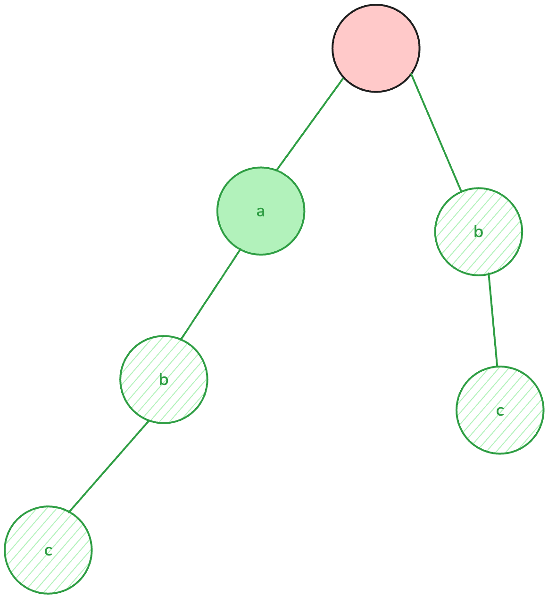
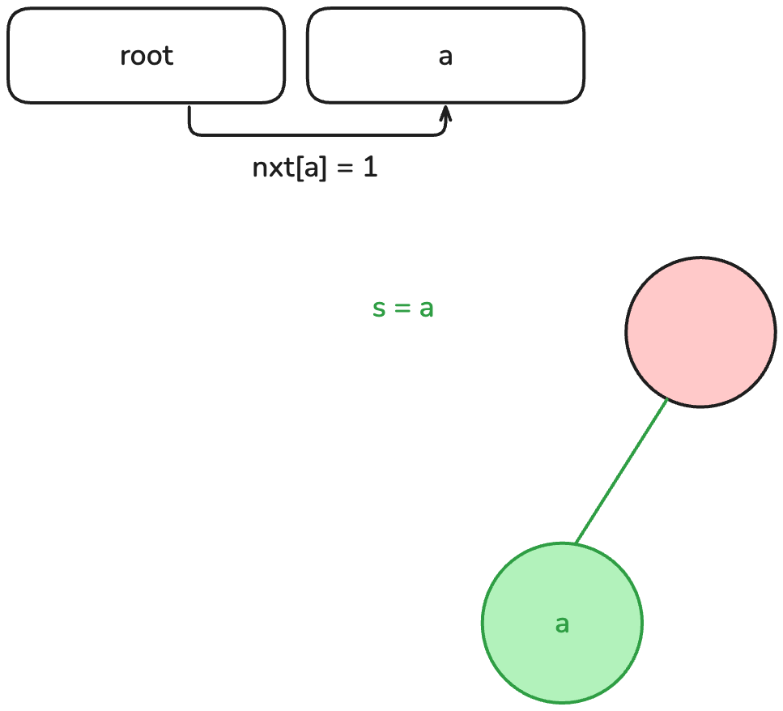
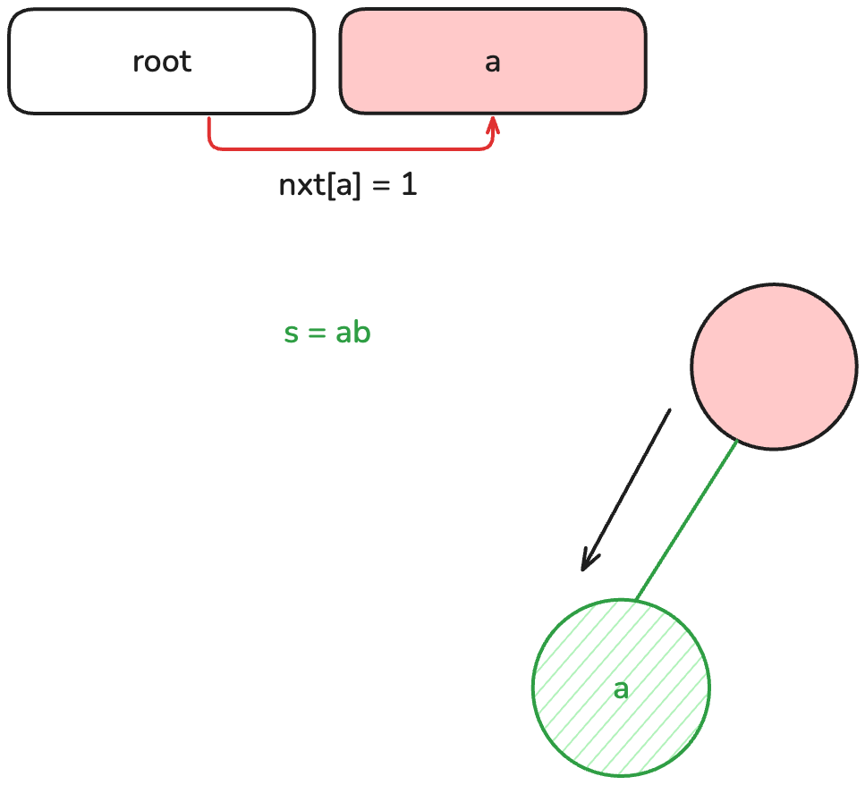
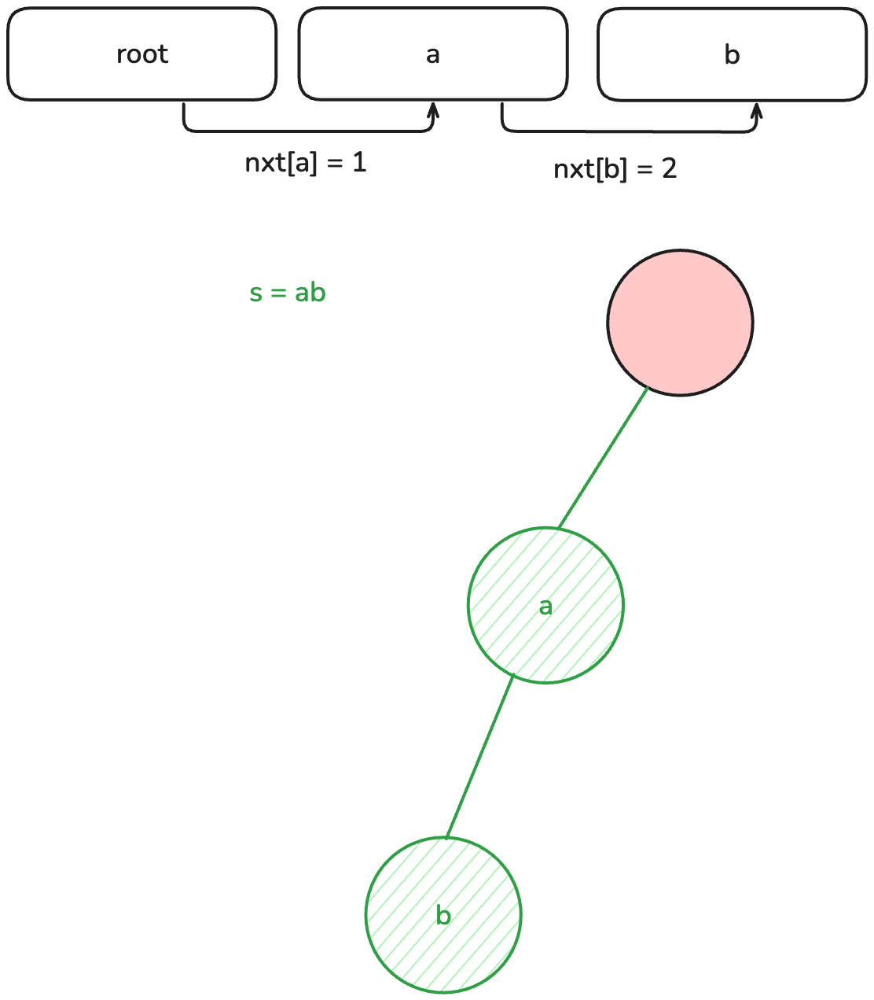
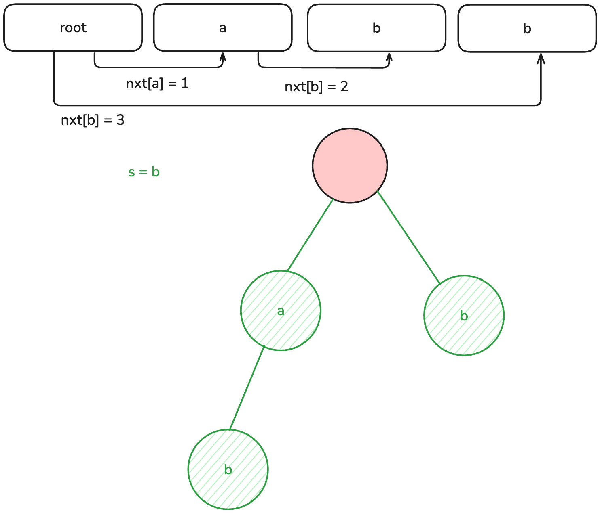

# Trie 字典樹

KMP 以及 Z value 等做法在一對一時很好用，線性的做法基本上是無人能敵，
但假設我們的問題變成下面這樣，就顯得有點不足了：

給定 $n$ 個字串，對於每個字串我們要計算出這個字串總共作為幾個字串的前綴出現，
例如 "abc","ab","bc","b" 的答案就是 1, 2, 1, 2。

兩兩之間做字串匹配演算法顯然不夠有效率，因此我們要在這裡介紹可以有效處理這個問題的資料結構：字典樹 Trie，也稱為前綴樹。

正如其名，這個資料結構是樹形的，以空字元為根，第 $i$ 層的節點代表存在一個字串的第 $i$ 個字元為 $c$。



斜線背景的節點代表有字串的結尾在此，幾設今天要詢問的不是單純前綴，而是問字串 $S$ 是否出現過，
這時詢問字串 "a" 如果沒有適當的處理，會誤以為有出現過，但是節點有標記是否為結尾的話，就可以很好的分辨。

我習慣用類似這樣的結構代表節點：

```cpp
const int CHARSET = 26
struct Node
{
    int nxt[CHARSET] = {};
    bool is_end = false;
    // 其他需要儲存的資訊
};
```

`nxt` 用來儲存下一層節點的指向，也許你會問為何不用指標？因為指標比較浪費空間，
當然我也不建議使用類似於 `int trie[N][CHARSET]` 的陣列存儲字典樹，因為這樣要浪費 $|S| \times |\sum|$ 的空間，實際上不會那麼稀疏。

因為需要動態新增，這裡我會使用 `vector` 來達成， `nxt[]` 則指向下一個節點在 `vector` 中的索引值 (index)。

```cpp
vector<Node> Trie(1, Node());
```

因為要有一個節點代表空，所以初始已經有一個元素。

## 插入

當我們有一個字串進來的時候，我們就從第一個字元開始，
如果第一個字元為 $c$ 我們就檢查根節點的 `nxt[c]` 是否為 0，代表目前沒有這個節點，
如果已經存在，我們就朝著那個節點前進，反之，先新增一個新的節點到 `vector` 中。










```cpp
void insert(const string &s)
{
    int cur = 0;
    for(char c: s)
    {
        if(!Trie[cur].nxt[c - 'a'])
        {
            Trie[cur].nxt[c - 'a'] = Trie.size();
            Trie.push_back(Node());
        }
        cur = Trie[cur].nxt[c - 'a'];
    }
    Trie[cur].is_end = true;
}
```


那麼我們要怎麼用字典樹來求解剛才的問題？我們其實可以幫每個節點新增計數器，
當插入一個字串時，經過的節點都 $+1$。

```cpp
const int CHARSET = 26
struct Node
{
    int nxt[CHARSET] = {};
    bool is_end = false;
    int cnt = 0;
};
vector<Node> Trie(1, Node());
void insert(const string &s)
{
    int cur = 0;
    for(char c: s)
    {
        if(!Trie[cur].nxt[c - 'a'])
        {
            Trie[cur].nxt[c - 'a'] = Trie.size();
            Trie.push_back(Node());
        }
        cur = Trie[cur].nxt[c - 'a'];
        Trie[cur].cnt++;
    }
    Trie[cur].is_end = true;
}
```

## 查詢

接著我們就可以透過查詢的實作，回傳找到的 cnt 值即是答案。

```cpp
int sec(const string &s)
{
    int cur = 0;
    for(char c: s)
    {
        if(!Trie[cur].nxt[c - 'a'])
            return -1; // 題目是用有記錄的字串查詢，理論上不會到這
        cur = Trie[cur].nxt[c - 'a'];
    }
    if(!Trie[cur].is_end)
        return -1; // 題目是用有記錄的字串查詢，理論上不會到這
    return Trie[cur].cnt;
}
```

在這樣的實作下，單次插入跟查詢都是 $O(|S|)$，我們省去了跟每個字串一一比較的時間，
只需要一次遍歷即可，如果你遇到任何只跟前綴 / 後綴 (反著建) 有關的字串題目，不妨用字典樹來嘗試看看。

## 01-Trie

給你 $n$ 個數字 $A$，我們希望找到一對數字 $A_i, A_j$ 使得 $A_i \oplus (\text{XOR})\; A_j$ 最大，
可能你沒有任何的頭緒，我們先把問題簡單化，給你一個數字 $x$ 如何在陣列中找到跟他 xor 後最大的數字？
我們會希望從最高位開始，跟 $x$ 越不像越好，

所以如果從高位開始，用 0 跟 1 建立一棵 01 字典樹，我們的目標就變成，在字典樹上查詢，但是每次根據當前的位元，
如果有不同的位元節點就朝另外一邊走，尋找一個盡量差最多的數字，這樣我們就可以在 $\displaystyle O(n \cdot\log{(\max_{1 \le i \le n}A_i)})$ 求解，
遠遠比直接列舉所有組合的 $O(n^2)$ 更有效率。

## 題單

- [CSES Word Combinations](https://cses.fi/problemset/task/1731/)
- [Codeforces Ever Forever](https://codeforces.com/gym/105920/problem/E)
- [Codeforces Vasiliy's Multiset](https://codeforces.com/problemset/problem/706/D)