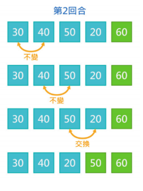
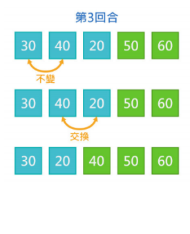
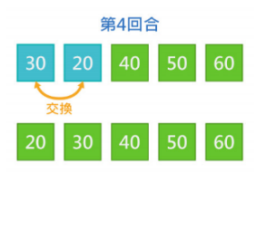
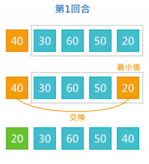
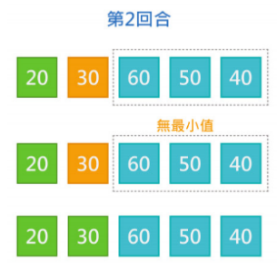
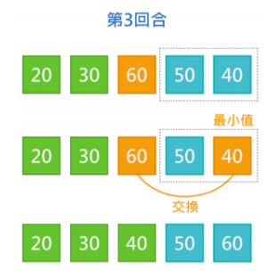
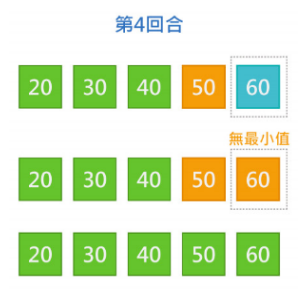

# 時間複雜度、排序、二分搜尋法

~~~admonish note title="作者"
M1kado (連子賢)
~~~

## 時間複雜度

什麼是時間複雜度，簡單來說，用來衡量你的程式需要跑多久。

```cpp
for(int i = 0; i < 10; i++){
    cout << i << "\n";
}
// 10次
```

```cpp
for(int i = 0; i < n; i++){
    cout << i << "\n";
}
// n次
```

談論複雜度前，要先講什麼是演算法
演算法: 將一系列步驟寫成程式，用以達成目的

舉個例子: 當你要做 1 + 2 + ... + 100 這個運算
我們可以用迴圈算，也可以用等差級數數學式一次算出來
這兩者目的相同，過程有所不同，屬於兩種不同的演算法

而複雜度就是用以評估演算法的好壞
時間複雜度 -> 評估演算法時間
空間複雜度 -> 評估演算法空間

像上面的例子
兩者結果一樣，過程運算的次數不一樣，則時間複雜度有差異

1+...+100
迴圈: 100次
公式: 3次

1+...+1000
迴圈: 1000次
公式: 3次

兩種算法，一種隨著值域範圍變大而線性變大，一種則不變
這就是不同方法有著不同複雜度的案例，那該如何衡量複雜度呢

#### 函數定義
$f(n)$: 用到一變數 $n$ 的演算法
$T(n)$: $f(n)$ 的複雜度 

Big-O Notation
定義: 若 $T(n) = O(g(n))$ 若且唯若存在一 $c$, $n_0$
使得當 $n \ge n_0$ 時 $0 \le T(n) \le c \times g(n)$

實際應用時，通常使用簡化的規則
1. 只保留增長最快的項 $O(n^2 + n) \rightarrow O(n)$
2. 省略常數 $O(100 n^3) \rightarrow O(n^3)$
3. 若有對數項，底數省略 $O(nlog_3n) \rightarrow O(nlogn)$

舉例:
$T(n) = 5 n^2 + 2n + 1 = O(n^2)$
$T(n) = 2n + 2^n = O(2^n)$
$T(n, m) = 2n + m^2 + 3m = O(m^2 + n)$
$T(n) = logn + \sqrt n = O(\sqrt n)$ 
因為 $\sqrt n$ 增長較快

在估計時間複雜度時，通常取 Big(O) 的最小值
例如 $T(n) = n$ 的情況下，我們會說 $O(n)$ 而非 $O(n^2)$

### 排序

將資料按照特定的方式排列稱為排序
很多算法的前提為已經排序過的資料
以下簡單介紹幾種排序

#### 1. bubble sort

第一筆資料開始，逐一比較相鄰兩筆資料
如果兩筆大小順序有誤則做交換，反之則不動
所有資料比較完第1回合後，可以確保最後一筆資料位置正確
以此類推，比較完 n - 1 回合後，就可以確保所有 n 個資料的位置都是正確的
排序完成！
時間複雜度: $O(n^2)$





#### 2. selection sort
反覆從未排序數列中找出最小值，將它與左邊的數做交換
可以有兩種方式排序：
由大到小排序時，將最小值放到末端
由小到大排序時，將最小值放到前端
時間複雜度： $O(n^2)$






3. c++ 內建 sort
實際上會使用到的 sort
時間複雜度: $O(nlogn)$

語法如下
```cpp
int arr[5] = {1, 2, 3, 4, 5};
sort(arr, arr + 5);
vector<int> v;
v.push(2);
v.push(1);
sort(vec.begin(), vec.end());
```

#### compare function

Compare function 需回傳一個布林值，代表「a 是否排在 b 的前面」
自定義 std :sort 的方式基本上有兩種：
1. 定義函數並傳入 Function Pointer（函數的名字）
```cpp
bool cmp(const int &a, const int& b) {
 return a > b;
}
int main() {
 int a[8] = {5, 6, 7, 8, 1, 2, 3, 4};
 sort(a, a + 7, cmp); / {8, 7, 6, 5, 3, 2, 1, 4}
 return 0;
}
```

2. 使用 C++ 內建的函數物件
```cpp
int a[8] = {1, 2, 3, 4, 5, 6, 7, 8};
// default is less<int>()
// use greater<int>() to sort in descending order
sort(a, a + 4, greater<int>());
// a will be {4, 3, 2, 1, 5, 6, 7, 8}
```


### 二分搜尋法

一種快速的搜尋法，那到底多快呢
假設我們今天要在一個 array 中，找到 x
最簡單的方法，迴圈掃一遍
時間複雜度: $O(n)$

那如何系統性的找，讓我們搜尋的次數減少
若這陣列已經排序好了，我們可以從這陣列隨便挑一格
假設第 100 格比 x 大，100以上的格子就不用找了
反之 100 以下的格子就不用找了
那如何挑格子，使得不管要搜尋的數字
比這格大禍比這格小，都能砍掉足夠多的格子呢
如果 ... 一次砍一半呢

ex: 搜尋5

| L |   |   | M |   |   |   | R |
|---|---|---|---|---|---|---|---|
| 1 | 2 | 3 | 4 | 5 | 6 | 7 | 8 |

| X | X | X | X | L | M |   | R |
|---|---|---|---|---|---|---|---|
| 1 | 2 | 3 | 4 | 5 | 6 | 7 | 8 |

| X | X | X | X | L M R  | X | X | X |
|---|---|---|---|---|---|---|---|
| 1 | 2 | 3 | 4 | 5 | 6 | 7 | 8 |

找到了

如果數字不在陣列內呢
如果不終止，就會陷入無窮迴圈，導致 TLE
那什麼時候要終止呢
除了已經找到答案時，
當 L > R 的時候，因為只要 $L \le R$
代表還有數字沒被檢查過

#### 應用
找到陣列中，比 5 小的最大數字

其實不用想的太麻煩，前面找到數字即為找到答案
在這邊就是找到一個格子，該格子比 5 小，並且下一格比 5 大
把這個當成終止條件，剩下跟上面都一樣，
值得注意的是記得陣列邊界判定，避免戳超出陣列導致 RE

...


## 小結

在這一章中，我們介紹了時間複雜度，排序，以及二分搜尋法，時間複雜度很難拿來單獨解題，但你幾乎每一題都需要用到，因為在猜測可能解法，估計解法可行性，以及 debug 或是與隊友討論中，時間複雜度都是很重要的一環，一個有經驗的競程選手，如果題目是不限制時間複雜度的，幾乎都可以找到一些時間複雜度高的可行解，但競程中等以上難度題目，非常多都會考驗選手如何用較好，時間複雜度較低的解法解題，因此正確評估複雜度在解題上面非常重要，而排序與二分搜則是工具，運用這兩者在一些題目上可以達到壓低複雜度的作用，因此在本章需學習的精神為，估計複雜度，以及如何應用工具降低複雜度。

## 題單

- [CSES 1084 - Apartment](https://cses.fi/problemset/task/1084)
- [CSES 1083 - Ferris Wheel](https://cses.fi/problemset/task/1090/)
- [CSES 1069 - Restaurant Customers](https://cses.fi/problemset/task/1619/)
- [CSES 1071 - Factory Machines](https://cses.fi/problemset/task/1620)
- [CSES 1070 - Sum of Three Values](https://cses.fi/problemset/task/1641)

## Reference

- 113 學年度簡報 講師 mixnight