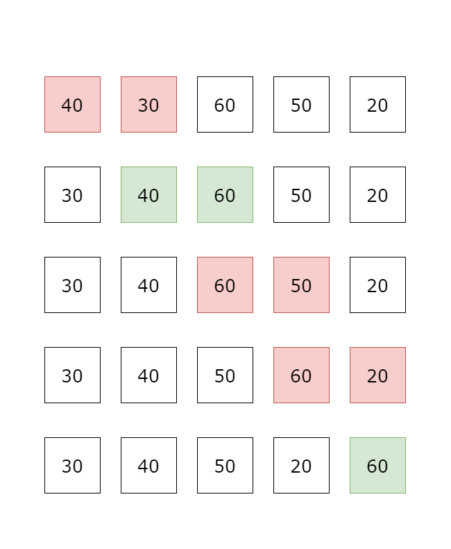
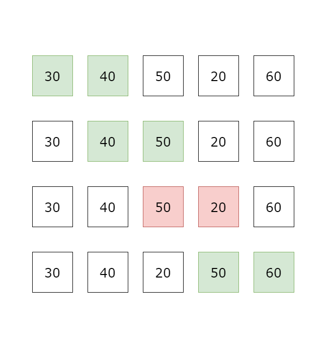
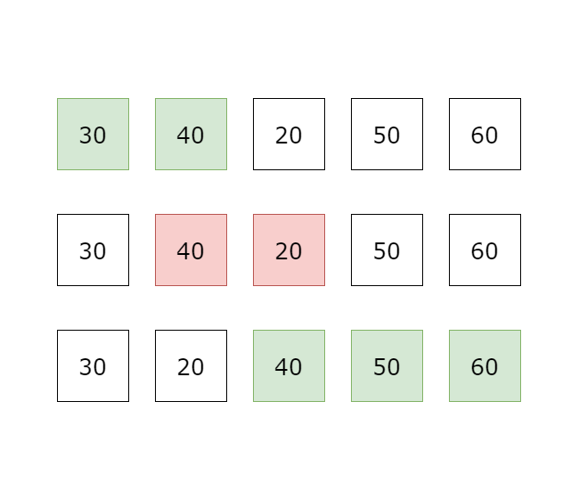
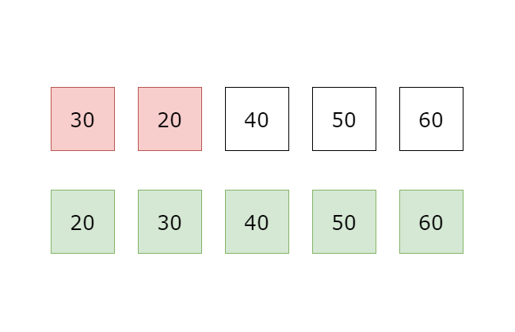
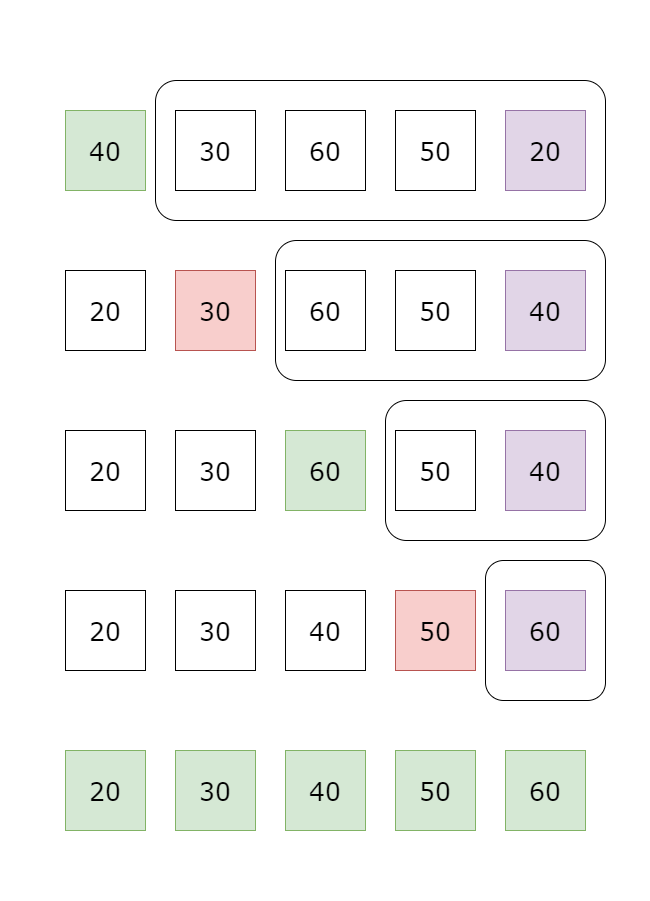

# 時間複雜度、排序、二分搜尋法

~~~admonish note title="作者"
M1kado (連子賢)
~~~

## 時間複雜度

演算法是我們設計的一系列步驟，用來解決問題或達成某個目的，
丟入對應的輸入，經過這些步驟後，會得到對應的輸出。

我們需要認知到，演算法的好壞不僅在於它能否正確地解決問題，
還在於它的效率。這就是時間複雜度的概念。

舉個例子: 當你要做 $1 + 2 + \cdots + 100$ 這個運算，
我們可以用迴圈算，也可以用等差級數數學式一次算出來，
這兩者目的相同，過程有所不同，屬於兩種不同的演算法。

而複雜度就是用以評估演算法的好壞，
- 時間複雜度 -> 評估演算法時間
- 空間複雜度 -> 評估演算法空間

下面有兩個簡單的迴圈，我們用執行次數來看它的效率。

```cpp
for(int i = 0; i < 10; i++){
    cout << i << "\n";
}
// 10次
```

```cpp
for(int i = 0; i < n; i++){
    cout << i << "\n";
}
// n次
```

這兩個迴圈的目的相同，都是輸出從 0 到某個數字的序列，
但它們的執行次數不同。
第一個迴圈執行了 10 次，而第二個迴圈則執行了 n 次。

像上面的例子
兩者結果一樣，過程運算的次數不一樣，則時間複雜度有差異。

以 $1 + 2 + \cdots + n$ 為例，公式解是 $\frac{n(n+1)}{2}$，需要進行加、乘跟除三個運算，
而迴圈解則需要進行 $n$ 次加法運算。

$1+...+100$
- 迴圈: $100$ 次
- 公式: $3$ 次

$1+...+1000$
- 迴圈: $1000$ 次
- 公式: $3$ 次

兩種算法，一種隨著值域範圍變大而線性變大，一種則不變
這就是不同方法有著不同複雜度的案例，那該如何衡量複雜度呢

### 函數定義
$f(n)$: 用到一變數 $n$ 的演算法
$T(n)$: $f(n)$ 的複雜度 

Big-O Notation
定義: 若 $T(n) = O(g(n))$ 若且唯若存在一 $c$, $n_0$
使得當 $n \ge n_0$ 時 $0 \le T(n) \le c \times g(n)$

實際應用時，通常使用簡化的規則
1. 只保留增長最快的項 $O(n^2 + n) \rightarrow O(n)$
2. 省略常數 $O(100 n^3) \rightarrow O(n^3)$
3. 若有對數項，底數省略 $O(n \log_3n) \rightarrow O(n\log n)$

舉例:
- $T(n) = 5 n^2 + 2n + 1 = O(n^2)$
- $T(n) = 2n + 2^n = O(2^n)$
- $T(n, m) = 2n + m^2 + 3m = O(m^2 + n)$
- $T(n) = \log n + \sqrt n = O(\sqrt n)$ 
因為 $\sqrt n$ 增長較快。

在估計時間複雜度時，通常取 Big-$O$ 的最小值，
例如 $T(n) = n$ 的情況下，我們會說 $O(n)$ 而非 $O(n^2)$，
其實也就是數學上 $\Theta(n)$ 的概念，但這裡不多做介紹。

因為 C++ 程式碼的執行時間一秒大約可以執行 $10^8$ 次，
因此我們可以用這個數字來估計時間複雜度，
例如 $O(n^2)$ 的演算法，當 $n = 10^4$ 時，
$10^4 \times 10^4 = 10^8$，
這時我們可以認為這個演算法是可行的，

但當 $n = 10^5$ 時，
$10^5 \times 10^5 = 10^{10}$，這時就會超過一秒，
因此我們可以認為 $O(n^2)$ 的演算法在 $n = 10^5$ 時不可行。

所以題目上的時間限制，以及輸入範圍，
都是用來估計時間複雜度的依據，
例如題目限制 $n \leq 10^5$ 時，
我們可以認為 $O(n^2)$ 的演算法不可行，
而 $O(n \log n)$ 的演算法是可行的，
而 $O(n)$ 的演算法則是最優解。

所以我們就可以通過時間複雜度來估計演算法的可行性，
如果時間複雜度過高，則可能會超過時間限制，
因此需要尋找更優的演算法。

## 排序

首先介紹第一個演算法，
將資料按照特定的方式排列稱為排序演算法，
很多算法的前提為已經排序過的資料，可以減少一些不必要的運算，
因此排序演算法在競程中非常常見，
以下簡單介紹幾種排序。

### 1. bubble sort

第一筆資料開始，逐一比較相鄰兩筆資料，
如果兩筆大小順序有誤則做交換，反之則不動，
例如由小到大排序時，若前一筆比後一筆大，則交換兩筆資料位置，
所有資料比較完第 $1$ 回合後，可以確保最後一筆資料位置正確，因為最大的元素會因為大小的關係，總是會比相鄰的元素大，
因此會被交換到最後一筆資料位置，
所以下一回合只要對前 $n - 1$ 筆資料進行同樣的比較，
確保第二大元素位置正確，
以此類推，比較完 $n - 1$ 回合後，就可以確保所有 $n$ 個資料的位置都是正確的。

<center>






</center>

因為第一輪比較需要比較 $n - 1$ 次，第二輪比較需要比較 $n - 2$ 次，以此類推
所以時間複雜度是 $O(n + (n - 1) + (n - 2) + ... + 1) = O(n^2)$


### 2. selection sort

每一輪都會找出目前未排序的資料中最小的資料，
和左邊第 $i$ 個資料比較，如果比左邊的資料小，
則交換兩筆資料位置，這樣每一輪都可以確保第 $i$ 小的資料被排到第 $i$ 個位置。

<center>

</center>

因為第一輪要掃過 $n - 1$ 的數字，第二輪要掃過 $n - 2$ 的數字，以此類推
所以時間複雜度是 $O((n - 1) + (n - 2) + ... + 1) = O(n^2)$

### 3. C++ 內建 sort

上面是幫助大家理解排序的概念，但是畢竟 $O(n^2)$ 的排序演算法在效率上並不夠好，
實際上會使用到的排序方法是透過 C++ 內建的 `std::sort` 函數，
這個函數使用了 Introsort 演算法，
Introsort 是一種混合排序演算法，結合了各種排序演算法來保證最差的時間複雜度不會高於 $O(n \log n)$，
因此在競程中，使用 `std::sort` 是非常常見的做法。

使用 `std::sort` 非常簡單，只需要包含 `<algorithm>` 標頭檔，
然後使用 `sort` 函數即可，

對於排序一個陣列或 vector，只要傳入起始位置和結束位置後一格的位置即可 (左閉右開)。

```cpp
int arr[5] = {1, 2, 3, 4, 5};
sort(arr, arr + 5);
vector<int> v;
v.push(2);
v.push(1);
sort(vec.begin(), vec.end());
```

你可能會想 `vec.begin()` 和 `vec.end()` 是什麼意思，
這是 C++ STL 中的迭代器，`begin()` 返回指向 vector 開始的迭代器，`end()` 返回指向 vector 結束後一格的迭代器，
它跟指標有點不太一樣，在這裡不深入細談，你只要知道它們所代表的意義即可。

#### compare function

因為 C++ 的 `std::sort` 函數是內建的，
如果我們想要由小到大排序，直接使用 `sort(arr, arr + 5)` 就可以了，
但如果我們想要自定義排序方式，例如由大到小排序，
就需要使用到 compare function，
這個函數用來比較兩個元素的大小，
`std::sort` 會根據這個函數的返回值來決定
元素的順序。

Compare function 需回傳一個布林值，代表「a 是否排在 b 的前面」，
如果回傳 true，則 a 會排在 b 的前面，
如果回傳 false，則 a 會排在 b 的後面。

~~~admonish caution title="注意"
compare function 在 a = b 時，應該要回傳 false，
否則會出現 Runtime Error。
~~~

自定義 std::sort 的方式基本上有兩種：
1. 定義函數並傳入 Function Pointer（函數的名字）
```cpp
bool cmp(const int &a, const int& b) {
    return a > b;
}
int main() {
    int a[8] = {5, 6, 7, 8, 1, 2, 3, 4};
    sort(a, a + 7, cmp); // {8, 7, 6, 5, 3, 2, 1, 4}
    return 0;
}
```

2. 使用 C++ 內建的函數物件
```cpp
int a[8] = {1, 2, 3, 4, 5, 6, 7, 8};
// 預設其實是 less<int>()，由小到大排序
// 使用 greater<int>() 由大到小排序
sort(a, a + 4, greater<int>());
// 因為指定範圍是 a + 4，所以只會排序前四個元素
// {4, 3, 2, 1, 5, 6, 7, 8}
```

## 二分搜尋法

假設我們今天要在一個 array 中，找到數字 $x$，
最簡單的方法就是透過迴圈掃一遍，
時間複雜度: $O(n)$。

但如果陣列很大，這樣的時間複雜度就會太高，
那有沒有更好的方法呢？

如果這一個陣列已經排序好了，我們可以從這陣列隨便挑一格檢查數字的大小，
假設第 $k$ 格比 $x$ 大，$k$ 以上的格子就不用找了，因為排序過後面的數字只會越來越大，
反之，如果第 $k$ 格比 $x$ 小，$k$ 以下的格子就不用找了，
因為排序過後前面的數字只會越來越小，

因為隨機找的話，雖然每次都有排除一小段需要搜尋的格子，
但是如果每次都剛好選到邊邊的格子，那麼效率還是很不好，
因此我們就想靠可以每次都選正中間的格子，
這樣每次都可以排除一半的格子。

ex: 搜尋5

| L |   |   | M |   |   |   | R |
|---|---|---|---|---|---|---|---|
| 1 | 2 | 3 | 4 | 5 | 6 | 7 | 8 |

一開始 L = 1, R = 8，所以正中間是 $\frac{1 + 8}{2} = 4.5$，取整數為 4，
所以 M = 4，檢查 M 的值跟 $5$ 的關係。

發現 a[M] = 4 < 5，所以我們可以排除掉前面 $4$ 個格子，
把 L 調整成 M + 1 = 5，


| X | X | X | X | L | M |   | R |
|---|---|---|---|---|---|---|---|
| 1 | 2 | 3 | 4 | 5 | 6 | 7 | 8 |

因為 L = 5, R = 8，所以正中間是 $\frac{5 + 8}{2} = 6.5$，取整數為 6，
所以 M = 6，檢查 M 的值跟 $5$ 的關係。
發現 a[M] = 6 > 5，所以我們可以排除掉後面 $2$ 個格子，
把 R 調整成 M - 1 = 5。


| X | X | X | X | L M R  | X | X | X |
|---|---|---|---|---|---|---|---|
| 1 | 2 | 3 | 4 | 5 | 6 | 7 | 8 |

因為 L = 5, R = 5，所以正中間是 $\frac{5 + 5}{2} = 5$，
所以 M = 5，檢查 M 的值跟 $5$ 的關係
發現 a[M] = 5 = 5，所以我們就找到了答案。

但這是運氣很好，數字剛好在陣列裡的情況，
如果數字不在陣列內呢？

假設我們把 a[M] 改成 $6$，

| X | X | X | X | L M R  | X | X | X |
|---|---|---|---|---|---|---|---|
| 1 | 2 | 3 | 4 | 6 | 6 | 7 | 8 |

這時檢查 M 的值跟 $5$ 的關係，
發現 a[M] = 6 > 5，所以我們會把 R 調整成 M - 1 = 4，

這時你會發現 L = 5, R = 4，
這時就沒有格子可以檢查了，
因此，當 L > R 時，就代表沒有找到數字，
這時我們可以回傳 -1 或是其他代表沒有找到的值，
如果不終止，就會陷入無窮迴圈，導致 TLE。

因為每一次都可以排除一半的格子，
那麼最多會排除幾次直到剩下 1 個格子？

假設陣列長度為 $n$，
第一次排除 $n / 2$ 個格子，剩下 $n / 2$ 個格子，
第二次排除 $(n / 2) / 2$ 個格子，剩下 $(n / 2) / 2$ 個格子，
第三次排除 $((n / 2) / 2) / 2$ 個格子，剩下 $((n / 2) / 2) / 2$ 個格子，
以此類推，直到剩下 1 個格子為止，
那麼排除的次數就是 $k$，滿足 $n / 2^k = 1$，
也就是 $k = \log_2 n$，
因此時間複雜度為 $O(\log n)$。


~~~admonish note title="例題"
在一個已經排序好的陣列中，
找到陣列中，比 $5$ 小的最大數字。
~~~

其實不用想的太麻煩，前面找到數字即為找到答案，
在這邊就是找到一個格子，該格子比 5 小，並且下一格比 5 大，
把這個當成終止條件，剩下跟上面都一樣，
值得注意的是記得陣列邊界判定，避免戳超出陣列導致 RE。


## 小結

在這一章中，我們介紹了時間複雜度，排序，以及二分搜尋法，時間複雜度很難拿來單獨解題，但你幾乎每一題都需要用到，因為在猜測可能解法，估計解法可行性，以及 debug 或是與隊友討論中，時間複雜度都是很重要的一環。

一個有經驗的競程選手，如果題目是不限制時間複雜度的，幾乎都可以找到一些時間複雜度高的可行解，但競程中等以上難度題目，非常多都會考驗選手如何用較好、時間複雜度較低的解法解題，因此正確評估複雜度在解題上面非常重要。

排序與二分搜則是工具，運用這兩者在一些題目上可以達到壓低複雜度的作用，因此在本章需學習的精神為估計複雜度，以及如何應用工具降低複雜度。

## 題單

- [CSES 1084 - Apartment](https://cses.fi/problemset/task/1084)
- [CSES 1083 - Ferris Wheel](https://cses.fi/problemset/task/1090/)
- [CSES 1069 - Restaurant Customers](https://cses.fi/problemset/task/1619/)
- [CSES 1071 - Factory Machines](https://cses.fi/problemset/task/1620)
- [CSES 1070 - Sum of Three Values](https://cses.fi/problemset/task/1641)

## Reference

- 113 學年度簡報 講師 mixnight